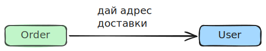
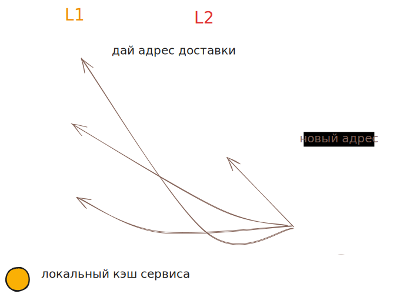

# Описание кейса

- Есть два сервиса Order и User
- Order'у нужен адрес доставки, чтобы сформировать заказ. Он запрашивает его у User

# Проблемы

- user лег, order не может создать заказ, т.к. не может получить адрес
- Сделали дополнительные реплики order, но производительность не выросла, потому что каждая реплика синхронно запрашивает у user адрес, а он не может работать так быстро

# Решение - кэширование

- Одно из решений проблемы - кэшировать данные, которые нужны order'у от user'а
  - В этом случае если user ляжет, order сможет взять данные из кэша
  - Масштабирование ускорит работу order, поскольку ему не придется дергать user - данные он возьмет из кэша, что кратно быстрее
- Кэш не избавляет полностью от необходимости обращаться к user, просто сводит эти обращения к минимуму

## L1 и L2 кэш

- `L1`-кэшем называется локальный кэш внутри памяти процесса сервиса.
  - Персональный кэш, так сказать, свой у каждой реплики.
  - Можно реализовать наивно через Map, но обычно используются библиотеки (чтобы иметь реализацию TTL, LRU).
  - Нужен для максимальной быстроты доступа.
- `L2`-кэш - общий кэш, работает как отдельный сервис, доступ к которому осуществляется через сетевой вызов.
  - Например, redis.
  - Нужен для снижения нагрузки на "источник правды" (сервис user в данном примере)

## Базовая схема работы

Получение данных, заполнение кэша:

- order'у нужен адрес пользователя.
- сначала он смотрит в L1. Если нет - смотрит в L2. Если и там нет - делает вызов к user.
- получив от user данные, кладет их в L2 и L1.
- теперь остальным репликам order не придется дергать user - они возьмут данные из L2.

Данные в user изменяются, надо обновить кэш:

- обычно реализуется через очередь.
- при изменении данных user формирует событие и кладет его в брокер.
- брокер доставляет событие order'у.
- order может либо
  - инвалидировать значение (удалить)
  - обновить значение

## Способы заполнения кэша

- Lazy
- Warming-up

# Терминология

- `TTL` - Time To Live - время, в течение которого данные в кэше считаются актуальными. По истечении этого времени данные автоматически удаляются.
- `LRU` - Least Recently Used. Когда в кэше заканчивается место, что-то надо удалить. LRU алгоритм позволяет удалить данные, которые использовались реже всего.

# Вопросы и ответы

## Инвалидировать или обновлять?

- Зависит от размера данных
  - Если данных немного, можно их размещать прямо в событиях и тогда сервисы смогут заменять значения в кэше
  - Если данных много, тогда payload может быть неоправданно большим, и в этом случае проще инвалидировать значение

## Один "Redis" на всю систему или несколько?

- Зависит от размера системы и нагрузок на сервисы
  - У какого-то особенно нагруженного сервиса может быть собственный L2, который обслуживает только его
  - Менее нагруженные сервисы могут делить вместе один L2
  - Может быть кластер "редисов"

## Одно сообщение об изменении данных или несколько?

- Зависит от объема данных и количества сервисов, которым они нужны
  - Если данных много и разным сервисам нужны разные фрагменты этих данных, логичнее сделать разные сообщения, чтобы активировались только те сервисы, "чьи" данные изменились.

## Как именно L2 помогает снизить нагрузку на источник правды?

- Когда одной из реплик понадобились данные, она получает их и кладет себе в L1 и заодно в L2
- За счет этого, если второй реплике тоже потребуются эти же данные, она очевидно не обнаружит их в L1. Но в L2 они уже есть, поэтому ей не придется дергать user
- Когда поднимаются новые реплики или перезагружаются старые, их L1 пуст, поэтому L2 позволяет им получить данные без обращения к user