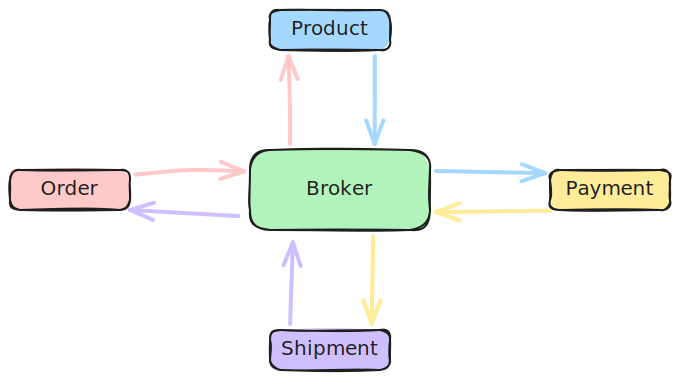
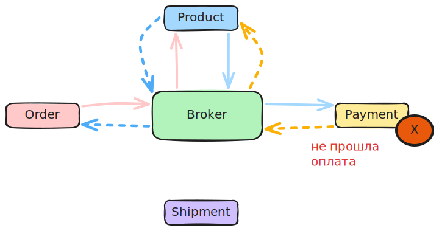

# Проблематика

- В микросервисной системе бизнес-процесс в большинстве случаев задействует множество микров. Например, процесс "Оформить заказ" может выглядеть так:

  ```
  Рассчитать стоимость -> Зарезервировать товар -> Принять оплату ->
  -> Сформировать тикет на сборку и отправку -> Отправить уведомление клиенту
  ```

  И каждый шаг может реализовываться отдельным микром. Соответственно, когда один микр свою часть сделал, начинает работать другой и т.д., пока все задействованные в процессе микры не отработают.

- Но в микросервисных системах обычно используется паттерн `Database per service`, т.е. у каждого микра своя собственная БД, не связанная с другими БД других микров. Соответственно, единой технической транзакции нет. Например, если вдруг оплата не пройдет, у нас нет возможности просто "откатить транзакцию", чтобы снять резев с товара.

- Это проблема - есть "логическая" транзакция (бизнес-процесс), которая состоит из множества независимых транзакций (локальные операции в БД каждого микра), и нужен способ отката этой "логической" транзакции, чтобы при ошибке на каком-то шаге система вернулась в корректное состояние (не было "зарезервированных вникуда" товаров в данном примере).

- Паттерн SAGA - является решением этой проблема.

# Идея паттерна

- Ключевая идея саги - это `компенсация`. Т.е. на каждое действие есть компенсирующее действие. Это может быть либо "обратное" действие (снять резерв с товара), либо иное действие, суть которого - вернуть систему в корректное состояние.
- Когда на каком-то шаге происходит ошибка, то для предшествующих шагов запускаются компенсирующие действия.
- При таком подходе получается, что целостности данных нет в моменте, но она есть *по итогу*.
  - Это называется `eventual consistency`, в противовес `strong consistency` при "классических" транзакциях, когда данные целостны в каждый момент.


# Техническая реализация

- Сага это концептуальный паттерн. Для его реализации не обязательно использовать события и очереди, хотя часто их как раз и используют.
- Для реализации можно пользоваться как `хореографией`, так и `оркестрацией`.


## Реализация через хореографию

- Подходит, когда сервисов не много и их взаимодействие легко осознать
- Суть в том что каждый микр сам должен знать, на какие события реагировать

### Успешный сценарий

- Все микры отработали без ошибок:



### Сценарий с ошибкой

- В микре оплаты что-то пошло не так, нужна компенсация:



- Компенсации показаны пунктиром
- Каждый микр сам решает, на какое компенсирующее событие реагировать. Например, Product реагирует на сообщение от Payment, делает компенсацию и тоже выпускает соответствующее событие, например "Резерв отменен". А Order например на событие "Не прошла оплата" не реагирует, но реагирует на "Резерв отменен". В общем, вся логика на что реагировать - при оркестрации ложится на плечи самих сервисов.

## Реализация через оркестрацию

- При оркестрации есть `оркестратор`, который координирует работу микров
  - Микрам уже не приходится думать, на какое событие реагировать
- При этом все сообщения делятся на
  - команды
  - ивенты
- самописный сервис
- готовые BPMN-решения (Buisness Process Model and Notation)
  - например, Camunda


# TODO

- Вопросы, которые предстоит рассмотреть:
  - идемпотентность, ретраи, порядок событий