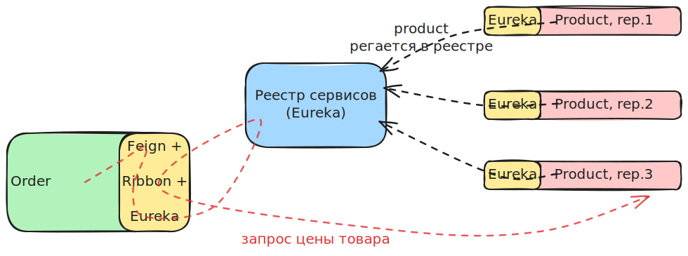

# Проблематика

- Сервис Order хочет обратиться к сервису Product, чтобы например получить цену товара
- У сервиса Product может меняться адрес - когда он перезапускается
  - Или может добавляться новый инстанс сервиса Product - тоже новый адрес
- Стало быть сервис Order не может полагаться на статический адрес при общении с сервисом Product, раз адрес нестабилен
  - И о дополнительно поднятом инстансе он тоже не может узнать


# Идея паттерна

- В систему добавляется `service register` - отдельный сервис, задача которого - знать "адреса" всех сервисов и их инстансов в системе.
- Когда сервисы стартуют, они регистрируются в реестре.
  - Могут регистрироваться сами, а могут не сами. Это дополнительные детали.
- Теперь когда Order хочет обратиться к Product, он может получить его расположение из реестра сервисов.
  - Рутина добычи реальных адресов Product, выбор инстанса (load balance, балансировка нагрузки), ретраи, в общем вся техническая работа с реестром, реализуется готовыми библиотеками или инфраструктурой, а Order будет пользоваться клиентами этих библиотек и для него вся эта грязь будет скрыта под капотом.


# Особенности реализации

- Обычно выполнение запроса выглядит так

  ```
  Order -> Балансировщик -> Реестр
                         -> Product
                         -> Order
  ```

- Запрос проходит такой путь:

  - Запрос из Order попадает в балансировщик
    - Балансировщик - это элемент, который отвечает за алгоритм выбора инстанса
  - Балансировщик запрашивает из реестра адреса всех инстансов Product
    - Запрос адресов не происходит при каждом запросе, балансировщик кэширует адреса
  - Выбирает согласно какому-нибудь алгоритму конкретный инстанс, шлет запрос на него
  - Получает ответ от Product и пересылает в Order

- Причем для Order балансировщик и реестр остаются за кадром, он просто шлет запрос на `product/10` как будто напрямую работает с Product, но эти запросы перехватываются и проходят описанный путь.

- Принципиальный вопрос здесь - это где находится балансировщик. Это делит дискавери на две ветки

  - `client-side discovery`
  - `server-side discover`

## client-side discovery

- Балансировщик в этом случае является частью сервиса, который шлет запрос (Order в данном случае)
- Пример такого балансировщика - Netflix Ribbon



- Что происходит на картинке:
  - В сервис Order встроены три клиента - Feign, Ribbon и Eureka.
  - Когда мы шлем запрос через Feign, он проходит связку Feign + Ribbon + Eureka, в которой инкапсулировано обращение в реестр и выбор инстанса Product
    - Как именно работает эта связка внутри - не столь важно.
    - Важно то, что балансировщик здесь не является отдельным сервисом, а является частью Order. Поэтому такой сценарий является client-side discovery.


## server-side discovery

- Балансировщик в этом случае является отдельным сервисом (или встроен в инфраструктуру, как в случае кубернетиса)
  - В остальном все то же самое


# Дополнительно

- Дискавери надо только при синхронном общении сервисов по rest и gRPC. Если общение через брокер, то сервисам нет смысла знать друг о друге, им надо знать только как обратиться к брокеру.


# Вопросы

- [x] Реестр сервисов (service registry) один в системе?
  - логически - один, т.к. в системе должен быть единственный источник истины о расположении сервисов
  - физически - может быть представлен кластером экземпляров для отказоустойчивости и доступности
- [x] Если реестр сервисов представлен кластером, то как сервис узнает адрес самого реестра?
  - В случае с готовыми решениями, например Eureka, можно указать адрес любого инстанса из кластера. Клиент эврики подключится к кластеру, сам узнает обо всех остальных инстансах и если изначальный адрес ляжет, то клиент автоматически переключится на другой инстанст.
  - В "гипотетическом общем" случае надо смотреть правила работы с технологией, которая предоставляет реализацию дискавери. 

