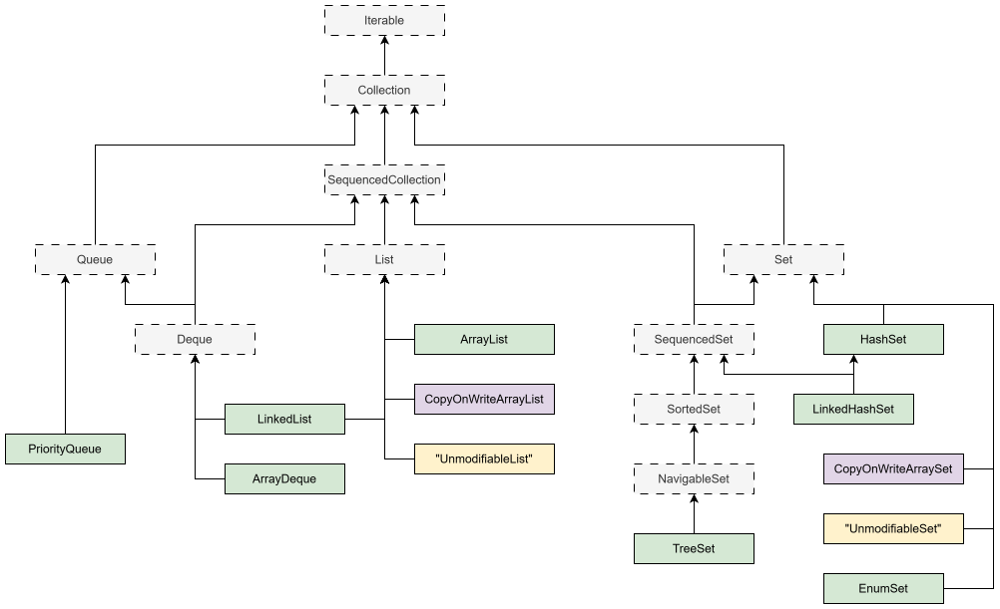

# Iterable и Iterator \ Spliterator

## Iterable

https://docs.oracle.com/en/java/javase/26/docs/api/java.base/java/lang/Iterable.html

- `Iterable` - это интерфейс
- Объект, который реализует Iterable, можно обходить через foreach
- В интерфейсе три метода:
  - `iterator()` - возвращает итератор, каждый вызов возвращает отдельный независимый итератор
  - `forEach(consumer)`
  - `spliterator()`


## Итератор (объект и интерфейс)

https://docs.oracle.com/en/java/javase/26/docs/api/java.base/java/util/Iterator.html

- Итератор - это объект, который реализует интерфейс `Iterator`
- Главная задача итератора - давать информацию, есть ли еще элементы, и возвращать очередной элемент
  - С помощью итератора можно также удалить последний выданный элемент
- Т.е. итератор это как бы курсор, перебирающий элементы один за другим в одном направлении
- В интерфейс 4 метода, ключевые это
  - `hasNext()`, `next()` - для проверки, есть ли еще элементы и возврата очередного элемента
  - `remove()` - удаляет из коллекции последний элемент, возвращенный итератором
- Каждая конкретная коллекция реализует итератор по-своему, потому что в разных коллекциях структура хранения даных отличается, соответственно и способы получения элементов разные

### fail-fast и fail-safe

- Итераторы обычных коллекций являются `fail-fast`
  - Это значит что если итератор в процессе перебора элементов обнаруживает стороннее структурное изменение (т.е. то, которое сделал не он сам), то он выбрасывает **ConcurrentModificationException**
    - Если изменение сделано не через сам итератор, это повод думать об изменении из другого потока. Вроде логично, потому что никакой нормальный человек не будет получать итератор, обходить пару элементов, потом изменять коллекцию, а потом продолжать обходить. Так что модификация из другого потока как будто бы единственная логичная причина изменения.
  - Структурные модификации - это те, которые изменяют размер коллекции. Добавление \ удаление элемента - это структурные модификации. Изменение элемента - нет.
- У коллекций из java.util.concurrent итераторы являются `fail-safe`
  - Это значит что они не выбрасывают исключение при сторонних структурных модификациях
  - Такие итераторы могут либо не видеть новых данных, либо видеть их частично. В общем это некий баланс между необходимостью параллельных модификаций и способностью видеть актуальные данные.
    - Достигается разными способами. Допустим, итератор на CopyOnWriteArrayList создает копию данных в момент своего создания и обходит эту копию, поэтому не видит никаких изменений в оригинальной коллекции.

### ListIterator

https://docs.oracle.com/en/java/javase/26/docs/api/java.base/java/util/ListIterator.html

- Разновидность итератора, которая позволяет двигаться не только вперед, но и назад
  - И не только удалять, но и добавлять элемент

## Spliterator

- Сплитератор создали изначально для Stream API, для параллельных стримов
- Он умеет делить коллекцию на части и обходить эти части независимо
  - Параллельные стримы пользуются этой возможностью для ускорения обработки коллекции


# view (представления коллекций)

- `view` - это "представление коллекции"
  - Это вспомогательный объект, который ссылается на оригинальную коллекцию.
- view полезны, когда надо что-то сделать над коллекцией, а она это не поддерживает, а трансформировать в другую коллекцию не охота. view не копируют элементы, а просто ссылаются на оригинальную коллекцию.
- изменения, примененные к оригинальной коллекции, всегда отображаются во view и наоборот - изменения во view изменяют оригинальную коллекцию.
- существует много методов для создания разных view для разных коллекций.

```java
// TODO потом вставить хорошие примеры
```


# Схема коллекций




# Интерфейсы коллекций

## Collection

https://docs.oracle.com/en/java/javase/25/docs/api/java.base/java/util/Collection.html

| Группа         | Метод                              | Что делает                                                   |
| -------------- | ---------------------------------- | ------------------------------------------------------------ |
| Добавление     |                                    |                                                              |
|                | `add(o):bool`, `addAll(coll):bool` |                                                              |
| Удаление       |                                    |                                                              |
|                | `clear():void`                     | Удалить все элементы                                         |
|                | `remove(o):bool`                   | Удалить конкретный элемент (только первое совпадение)        |
|                | `removeAll(coll):bool`             | Удалить пересечение                                          |
|                | `removeIf(pred):bool`              | Удалить все элементы, попадающие под условие (все совпадения, а не только первое) |
|                | `retailAll(coll):bool`             | Оставить пересечение, остальное - удалить                    |
| Запросы        |                                    |                                                              |
|                | `size()`                           | Текущее количество элементов в коллекции                     |
|                | `isEmpty():bool`                   | Пустая \ не пустая ли сейчас коллекция                       |
|                | `contains(o):bool`                 | Есть ли в коллекции такой элемент                            |
|                | `containsAll(coll):bool`           | Есть ли в коллекции все такие элементы                       |
| Преобразование |                                    |                                                              |
|                | `stream()`, `parallelStream()`     |                                                              |
|                | `toArray():arr<Obj>`               | Возвращает массив Object'ов                                  |
|                | `toArray(arr<T>):arr<T>`           | Мы сами должны создать массив и передать в метод, он будет копировать в него элементы. Если места не хватит, пересоздаст новый массив. Если места больше, чем надо, заполнит лишнее null'ами. |
|                | `toArray(fn<T>):arr<T>`            | Мы передаем функцию, которая должна создать и вернуть массив, в который метод будет копировать коллекцию. Метод нам в эту функцию передает size коллекции. |

- Несколько мыслей о коллекциях
  - Логику возврата bool и выбросов исключений лучше читать в документации, чтобы не было испорченного телефона

  - Как таковых методов "получения" элементов у Collection нет. Мне кажется потому, что получение сильно зависит от реализации. Например, у списка есть получение по индексу, у очереди можно получить первый \ последний элемент, а для обычного set вообще нет понятия первый \ последний и порядок нестабильный, поэтому у него не может быть таких методов.

    


## SequencedCollection

https://docs.oracle.com/en/java/javase/25/docs/api/java.base/java/util/SequencedCollection.html

- "Стабильный порядок элементов", например
  - Порядок добавления (типа списка)
  - Порядок, зависящий от контента элемента (например, деревья хранят элементы в отсортированном виде)

| Группа     | Метод                                | Что делает                                                   |
| ---------- | ------------------------------------ | ------------------------------------------------------------ |
| Добавление |                                      |                                                              |
|            | `addFist(e):void`, `addLast(e):void` |                                                              |
| Получение  |                                      |                                                              |
|            | `removeFirst():e`, `removeLast():e`  | Получение с удалением                                        |
|            | `getFirst():e`, `getLast():e`        | Получение без удаления                                       |
| Операции   |                                      |                                                              |
|            | `reversed():scoll`                   | Возвращает view для коллекции, с обратным порядком элементов. Для каждого более конкретного интерфейса возвращает тип коллекции этого же типа (например, SequencedSet > SequencedSet итд). Все структурные изменения, сделанные через view, изменяют исходную коллекцию. А изменения в исходной коллекции могут отражаться \ нет во view, это надо смотреть в конкретном случае. |

- Мысли о последовательной коллекции
  - Поскольку есть строгий порядок, то есть понятие первого \ последнего элемента. Стало быть появляются методы получения - первого и последнего элемента.


## Queue

https://docs.oracle.com/en/java/javase/25/docs/api/java.base/java/util/Queue.html

| Концепция | Особенности        | Метод                 |
| --------- | ------------------ | --------------------- |
| добавить  | с \ без исключения | `add(e)`, `offer(e)`  |
| get       | с \ без исключения | `remove()`, `poll()`  |
| examine   | с \ без исключения | `element()`, `peek()` |

- Мышление
  - Классическая очередь с "головой" head и "хвостом" tail, добавление в хвост, получение из головы
  - examine - это как бы "посмотреть", "изучить" элемент, логически не подразумевает удаление
- Словарь
  - peek - перевод "заглядывать" (I peek into the hole, I struggle for control - Marilyn Manson), как бы "заглянуть в очередь", поэтому без удаления.
  - poll - один из переводов это "подрезать верхушки", а еще есть русское слово "полоть", т.е. "выдергивать", поэтому poll удаляет элемент из очереди.
  - offer - "предложить" вставить элемент. Не заставить вставить, а предложить, потому что в случае невозможности вставить исключения не будет. Мы предложили, нам отказали - ну и ладно.


### Deque

https://docs.oracle.com/en/java/javase/25/docs/api/java.base/java/util/Deque.html

- Всё, что умеет Queue + "F \ L"-модификации, т.к. дек это sequence-коллекция

| Концепция                | Особенности    | Метод                                 |
| ------------------------ | -------------- | ------------------------------------- |
| очередь как стек         |                | `push(e)` void, `pop()` e             |
| удалить F \ L совпадение | просто удаляет | `remove[First\Last]Occurence(o)` bool |


## List

https://docs.oracle.com/en/java/javase/25/docs/api/java.base/java/util/List.html

- "Индексированное хранилище"

| Группа              | Метод                               | Что делает                                           |
| ------------------- | ----------------------------------- | ---------------------------------------------------- |
| Операция по индексу |                                     |                                                      |
|                     | `add(i, e):void`                    | Вставить в i-индекс, а что было - сдвинуть вправо    |
|                     | `addAll(i, coll):bool`              |                                                      |
|                     | `get(i):e`                          |                                                      |
|                     | `set(i, e):e`                       | Заменяет элемент на новый, а возвращает старый       |
|                     | `remove(i):e`                       | Удаляет элемент по индексу и возвращает этот элемент |
|                     | `indexOf(o):i`, `lastIndexOf(o):i`  |                                                      |
| view                |                                     | fail-fast                                            |
|                     | `subList(i, j):list<E>`             |                                                      |
|                     | `reversed():list<E>`                |                                                      |
| Итерация+           |                                     |                                                      |
|                     | `listIterator()`, `listIterator(i)` |                                                      |

- Мышление
  - "Индексированное хранилище", значит все собственные операции будут вертеться вокруг индексов. Просто задуматься, а какие возможности добавляет факт наличия индекса, и всё.


## Set

https://docs.oracle.com/en/java/javase/25/docs/api/java.base/java/util/Set.html

- Не добавляет новых методов.

### SequencedSet

https://docs.oracle.com/en/java/javase/25/docs/api/java.base/java/util/SequencedSet.html

- Не добавляет новых методов.
- Гарантирует порядок элементов. Какой именно порядок - зависит от реализации.

### SortedSet

https://docs.oracle.com/en/java/javase/25/docs/api/java.base/java/util/SortedSet.html

| Группа | Метод | Что делает |
| ------ | ----- | ---------- |
|        |       |            |
|        |       |            |
|        |       |            |
|        |       |            |
|        |       |            |
|        |       |            |
|        |       |            |


- subset(E, E)
- headSet(→E)
- tailSet(E→)

### NavigableSet

https://docs.oracle.com/en/java/javase/25/docs/api/java.base/java/util/NavigableSet.html

- lower(e) <
- higher(e) >
- floor(e) >=
- ceiling(e) <=

## Map

TODO


# Реализации

## List

### ArrayList и LinkedList

- `ArrayList` - список на основе массива
- `LinkedList` - список на основе двусвязного списка

Что выбрать?

- В 99% случаев, когда нужен список, - выбираем ArrayList
- LinkedList почти никогда не нужен, потому что технически уступает массиву
  - Был какой-то случай вроде видеоредакторов, когда позиция вставки известна заранее и не надо итерироваться для этого, вот тогда список подходил бы больше
- Недостатки LinkedList
  - Все недостатки связаны с особенностями работы процессора с памятью
  - Самая быстрая память - это регистры, потом кэш, потом оперативка. Когда нужных данных не оказывается в регистрах, они ищутся в кэше, потом в оперативке. Процессор считывает данные из оперативки пачками, т.е. грубо говоря не только нужные данные, но и данные в округе.
  - Во-первых, узел списка жрет много памяти, тк хранит две ссылки. Соответственно, из-за этого данных в кэше помещается меньше, поэтому чаще приходится лезть в оперативку, что замедляет работу.
  - Во-вторых, узлы располагаются в произвольных местах памяти, не строго друг за другом. Поэтому когда процессор читает пачку данных из оперативки, вероятность что два элемента списка окажутся рядом гораздо меньше, чем у массива. Из-за этого опять выходит что надо чаще лезть в оперативку.

### CopyOnWriteArrayList

- Потокобезопасный список
- Безопасность за счет того что при любом изменении списка сначала создается копия списка, потом она изменяется, а потом ее ссылка заменяет ссылку на оригинальный список

### "UnmodifiableList"

- Такого типа на самом деле нет, это условное название для неизменяемых списков, которые возвращают методы `List.of()` и `List.copyOf()`


## Set

### HashSet

- Реализация на основе хэш-таблицы
  - `Бакет` (bucket) - это ячейка массива, в которой лежит элемент.
  - При коллизиях, для хранения столкнувшихся элементов сначала используется список, потом красно-черное дерево
    - Коллизии не влияют на момент пересчета хэш-таблицы
  - Хэш-функции стараются делать так, чтобы значения как можно равномернее распределялись по массиву
  - `load` (загрузка) хэш-таблицы - это `количество сохраненных элементов / кол-во бакетов`
    - например, в таблице сейчас хранится 103 элемента, а количество бакетов 50, тогда загрузка 103 / 50 = 2.06
  - Если загрузка больше 0.75, происходит `resizing` - выделяется новый массив большего размера и элементы перекладываются в него
    - При этом происходит повторное вычисление хэша элементов
    - Бакет, в который надо положить элемент, вычисляется на основе хэша элемента и размера массива. Так что из-за изменения размера массива, столкнувшиеся в прошлый раз элементы на этот раз оказываются в разных бакетах.
      - Именно из-за того, что элементы меняют положение в массиве при пересчете, HashSet не дает гарантий последовательнсти элементов, последовательность нестабильная.
- Скорости
  - add, remove, contains быстрые, константные, если таблица загружена слабо и нет коллизий
  - итерация медленная, потому что надо проходить по всем ячейкам массива и проверять, есть ли в них данные


### LinkedHashSet

- То же самое что HashSet, только элементы хранят ссылки друг на друга
- Итератор возвращает элементы в порядке их добавления.


### TreeSet

- Использует красно-черное дерево.
- Итератор возвращает элементы по старшинству, от меньших к большим.


## Map

### HashMap


# Полезные примеры

## Создание коллекций

### Списки

```java
// Создаются немодифицируемые списки
List<Integer> unmodif = Arrays.asList(5, 7, 13, 20);
List<Integer> unmodif = List.of(5, 7, 13, 20);
```

```java
// Модифицируемый список создается только через конструктор
var modif = new ArrayList<Integer>(
    List.of(5, 7, 13, 20)
);
```


### Сеты

HashSet<T> newHashSet(int numElements)


# TODO

- С созданием коллекций разобраться нормально, разные способы и чем отличаются, как эффективнее
- Collections.addAll - посмотреть что еще есть в Collections и вообще что такое Collections
- mondayTasks.equals(Set.of(logicCode, mikePhone)); как equals для коллекций работает?
- В методах Collection и наверное прочих возвращается true \ false, бросается исключение в разных случаях. Надо получше разобраться, что именно когда возвращается и почему. Это факультативно. Вероятно, после полного обзора всего.
- see “Synchronized Collections” on page 281) around ArrayList or LinkedList.
- equals и hashCode для коллекций, вроде пишут что они как-то переопределены?
- natural order что такое?
- К конкурентным версиям вернуться потом, щас вообще не варик тратить время


# Вопросы

- Соответствие типов в коллекции - добавлять можно элементы только строго определенного типа, а удалять - элементы любого типа?
- Добавление \ удаление элементов возвращают bool, а могут выбросить исключение. От чего это зависит? Какие ситуации?
- Что такое spliterator?
- circular array что такое? (обсуждалось в деках вроде)


# Разобрать примеры кода

```java
Collection<Task> allTasks_2 = Stream.of(mondayTasks,tuesdayTasks)
.flatMap(Collection::stream)
.collect(Collectors.toSet());
assert allTasks_2.equals(Set.of(logicCode, mikePhone, ruthPhone,
databaseCode, guiCode, paulPhone));
```

