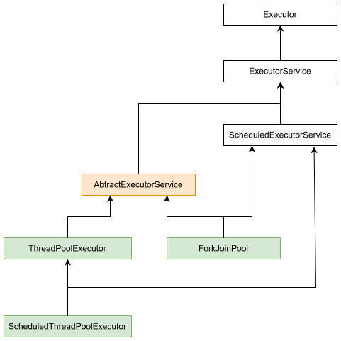

# Обзор

- ~~Способы объявить поток~~
  - ~~Наследование от класса `Thread`~~
  - ~~Реализация *функциональных* интерфейсов `Runnable` или `Callable`~~
  - ~~Лямбды~~
- ~~Запуск потока~~
  - ~~"Голый" запуск~~
  - ~~Пулы потоков, интерфейс ExecutorService~~
- Исключения в потоках
  - TODO
- Возврат значения из потока
- Виды потоков
  - daemon и "не-daemon" ("пользовательские")
  - Виртуальные потоки
- Приоритет потоков
- Жизненный цикл потоков
  - фыва
- Дополнительные вещи
  - Виртуальные потоки
  - sleep() метод потока
  - isAlive(), getName(), setName(), setPriority(), getPriority()
  - yield()
  - Future, CompletableFuture, ScheduledFuture
  - FutureTask, ExecutorService
  - отмена задач \ потока
  - ThreadFactory
  - ThreadGroup???
  - Что можно сделать непосредственно с потоком, его методы вроде join, sleep и т.д.
- TODO
  - Project  Loom


# Описываем поток

- Первым делом надо *описать* код, который мы хотим выполнить многопоточно. Это можно сделать разными способами. Запуск - дело отдельное.

## Класс Thread

```java
class MyThread extends Thread {
    @Override
    public void run() {
        System.out.println("Поток: " + Thread.currentThread().getName());
    }
}
```

- Наследование от Thread - один из, но не лучший способ пользоваться многопоточкой. Из-за того что в джаве нет множественного наследования, наследоваться от Thread может быть неудобно.
  - Поэтому чаще пользуются интерфейсом Runnable.
    - Thread сам тоже реализует Runnable.


## Функциональный интерфейс Runnable

- Концептуально Runnable - это "задача без результата".

```java
class MyTask implements Runnable {
    @Override
    public void run() {
        System.out.println("Поток: " + Thread.currentThread().getName());
    }
}
```

- Runnable vs Thread
  - В джаве нет множественного наследования, поэтому если мы хотим выстроить через наследование бизнес-логику, то многопоточность внедрять в эту структуру через наследование будет не удобно. А интерфейсов классу можно добавлять сколько хочешь, поэтому добавление многопоточности через реализацию Runnable зачастую удобнее, чем через наследование от Thread.


## Функциональный интерфейс Callable

- Концептуально Callable - это "задача с результатом".

```java
class MyTask implements Callable<String> {
    @Override
    public Integer call() throws Exception {
        return 23;
    }
}
```

- Thread и Runnable не предполагают возврат результата. Поэтому если нужно что-то вычислить в потоке и вернуть результат - пользуемся `Callable`.
- TODO: 
  - throws Exception тут зачем?


## Использование лямбд

- Для описания тела потока не обязательно объявлять отдельный интерфейс или класс, можно воспользоваться лямбдами.
- Лямбды и Thread:

```java
Thread t = new Thread(() -> {
    System.out.println("Поток: " + Thread.currentThread().getName());
});
```

- Лямбды и Runnable \ Callable:

```java
Runnable task = () -> {
    System.out.println(Thread.currentThread().getName() + " runnable выполняется.");
};
```

```java
Callable<String> task = () -> {
    System.out.println(Thread.currentThread().getName() + " callable выполняется.");
    return "23 - Nichts ist so wie es scheint";
};
```

- Лямбду можно передавать в любые места, где ожидается Runnable или Callable.


# Запускаем поток

## "Голый" запуск

- Под "голым" запуском я имею ввиду запуск непосредственно через метод start() у треда.
- TODO: вероятно, голый запуск почти никогда не используется? Описать когда это приемлемо, а когда нет.

### Запуск Thread

```java
public class Main {
    public static void main(String[] args) {
        Thread t = new MyThread();
        t.start();
    }
}

class MyThread extends Thread {
    @Override
    public void run() {
        System.out.println("работаю");
    }
}
```

- Важное отличие методов run() и start()
  - Метод `run()` - это просто обычный метод. Если его вызвать, то код просто выполнится в текущем потоке, как и любой другой обычный метод.
  - Метод `start()` содержит всю многопоточную "обвязку". Его вызов создает новый поток и выполняет в нем код, описанный в методе run.
  - Поэтому запускать поток надо именно через start().


### Запуск Runnable

- Непосредственно саму по себе runnable-задачу запустить нельзя, потому что Runnable это просто интерфейс, он нужен только для описания задачи и не обладает механиками создания потока.
- Поэтому для выполнения задачи мы либо передаем ее в Thread, либо в `пул потоков`, либо еще куда-то где принимают Runnable.
  - Например, через Thread

```java
Runnable task = () -> {
    System.out.println(Thread.currentThread().getName() + " runnable выполняется.");
};

Thread t = new Thread(task);  // <-- Передали задачу в конструктор треда
t.start();
```


### Запуск Callable

- Callable-задачи обычно запускают с помощью пула.
- Запустить Callable непосредственно через Thread так же, как мы сделали с Runnable, не выйдет.
  - Дело в том, что Thread работает исключительно с Runnable. А поскольку все механизмы многопоточки под капотом все равно сводятся к использованию Thread, то и Callable, и все остальное в итоге является просто хитрой оберткой над базированным Runnable.
  - Очень примерно это можно представить как-то так:

```java
Callable<Integer> task = () -> 23;

FutureTask<Integer> futureTask = new FutureTask<>(task);
Thread thread = new Thread(futureTask);
thread.start();
Integer result = futureTask.get();
```

- Если интересно, вот дока по [FutureTask](https://docs.oracle.com/en/java/javase/26/docs/api/java.base/java/util/concurrent/FutureTask.html). Этот класс реализует и Runnable, и Future, поэтому его можно и в тред передать, и результат получить.


## Запуск через пул

- Пулы потоков это более продвинутый способ работы с потоками, нежели "голый" запуск. Поэтому про пулы я напишу в отдельном разделе, а тут просто упоминание оставлю, чтобы подчеркнуть что есть такой способ.


# Пулы потоков

## Зачем нужны пулы

- Каждый раз создавать новый поток - накладно, потому что задействуются механизмы ОС, выделяется \ освобождается память и т.д. Поэтому эффективнее использовать пулы потоков. Поток берется из пула, в нем выполняется задача, после этого поток возвращается в пул.
- Пулы позволяют контролировать количество потоков, очереди задач и т.д. В общем, пулы - это более продвинутый способ работы с потоками, нежели "голый" запуск.
- TODO: Дополнительные вещи, вроде когда все потоки заняты, очередь


## Иерархия интерфейсов и классов

| Интерфейс                  |                                                              | Дока                                                         |
| -------------------------- | ------------------------------------------------------------ | ------------------------------------------------------------ |
| `Executor`                 | 🔸Интерфейс с единственным методом execute(). Его базовая задача - отвязать выполнение задачи от явного создания потока. Т.е. вместо того чтобы сами морочиться с созданием потока, мы просто отправляем задачу в Executor и он сам все создает. 🔸Выполнение самое простецкое - "отправил и забыл", без возможности получить результат, без возврата Future. 🔸Отправить на выполнение умеет только одну задачу. | [Читать](https://docs.oracle.com/en/java/javase/26/docs/api/java.base/java/util/concurrent/Executor.html) |
| `ExecutorService`          | 🔸Продвинутое расширение Executor'а. 🔸Позволяет отправлять несколько задач на выполнение. 🔸При отправке задачи на выполнение возвращает нам Future, что позволяет нам взаимодействовать с выполняющимися задачами. | [Читать](https://docs.oracle.com/en/java/javase/26/docs/api/java.base/java/util/concurrent/ExecutorService.html) |
| `ScheduledExecutorService` | 🔸 TODO                                                       | [Читать](https://docs.oracle.com/en/java/javase/26/docs/api/java.base/java/util/concurrent/ScheduledExecutorService.html) |




## Создаем пул

### Executors - готовые пулы потоков

- https://docs.oracle.com/en/java/javase/26/docs/api/java.base/java/util/concurrent/Executors.html
- В классе `Executors` много статических методов, которые возвращают преднастроенные пулы, например:

```java
ExecutorService pool = Executors.newFixedThreadPool(4);
ExecutorService pool = Executors.newCachedThreadPool();
ExecutorService pool = Executors.newSingleThreadExecutor();
// и т.д., там много разных, выбираем какой надо
```

- Обзор имеющихся готовых пулов сделаю в отдельном разделе.
- Все они по сути просто создают пулы из показанных на схеме классов, передавая в них определенные параметры.


### Создание пула самостоятельно

- Если настройки готовых пулов нам не подходят, можно создать пул самостоятельно из классов:

| Классы                        | Документация                                                 |
| ----------------------------- | ------------------------------------------------------------ |
| `ThreadPoolExecutor`          | [Читать](https://docs.oracle.com/en/java/javase/26/docs/api/java.base/java/util/concurrent/ThreadPoolExecutor.html) |
| `ForkJoinPool`                | [Читать](https://docs.oracle.com/en/java/javase/26/docs/api/java.base/java/util/concurrent/ForkJoinPool.html) |
| `ScheduledThreadPoolExecutor` | [Читать](https://docs.oracle.com/en/java/javase/26/docs/api/java.base/java/util/concurrent/ScheduledThreadPoolExecutor.html) |

- Делать это приходится, похоже, не так уж редко. TODO: правда разбираться в этом сейчас я, конечно же, не буду.
- Пример создания пула самостоятельно:

```java
ThreadPoolExecutor executor = new ThreadPoolExecutor(
    4,
    8,
    60L, TimeUnit.SECONDS,
    new ArrayBlockingQueue<>(100),
    new ThreadFactoryBuilder().setNameFormat("img-resize-%d").build(),
    new ThreadPoolExecutor.CallerRunsPolicy()
);
```

- Краткое описание параметров - в отдельном разделе про настройки пула.


## Отправляем задачу в пул

- https://docs.oracle.com/en/java/javase/26/docs/api/java.base/java/util/concurrent/ExecutorService.html#submit(java.lang.Runnable)

```java
Future<?> future = pool.submit(() -> {
    System.out.println(Thread.currentThread().getName() + " runnable выполняется в пуле.");
});
```

```java
Future<Integer> future = pool.submit(() -> {
    System.out.println(Thread.currentThread().getName() + " callable выполняется в пуле.");
    return 23;
});
```

- TODO: вероятно тут можно отправлять по одной задаче, а можно пачку? через invokeAll?


## Закрыть пул

- TODO:


# Работаем с отправленными задачами

## Future - интерфейс

- https://docs.oracle.com/en/java/javase/26/docs/api/java.base/java/util/concurrent/Future.html
- `Future` - это интерфейс, который позволяет работать с запущенной задачей.
  - Например, дождаться окончания выполнения, получить результат.
  - Когда мы отправляем задачу в пул, например через submit, то получаем в ответ Future.
  - 


## CompletableFutute - класс

- https://docs.oracle.com/en/java/javase/26/docs/api/java.base/java/util/concurrent/CompletableFuture.html
- 


# Обзор готовых пулов

- TODO: перечислить кратко описать некоторые готовые пулы, не все, а для начала хотя бы самые простые


# Настройки пула

## ThreadPoolExecutor

- [Конструктор со всеми доступными параметрами](https://docs.oracle.com/en/java/javase/26/docs/api/java.base/java/util/concurrent/ThreadPoolExecutor.html#%3Cinit%3E(int,int,long,java.util.concurrent.TimeUnit,java.util.concurrent.BlockingQueue,java.util.concurrent.ThreadFactory,java.util.concurrent.RejectedExecutionHandler))

```java
ThreadPoolExecutor executor = new ThreadPoolExecutor(
    1,  // corePoolSize
    2,  // maximumPoolSize
    0L, // keepAliveTime
    TimeUnit.MILLISECONDS,  // unit
    new ArrayBlockingQueue<>(2),  // workQueue
    null,  // threadFactory
    new ThreadPoolExecutor.AbortPolicy()  // handler
);
```


### Простые настройки

- `corePoolSize` - количество потоков, которые всегда остаются в пуле, даже если простаивают.
- `maximumPoolSize` - максимальное количество потоков в пуле.
- `keepAliveTime` - время, после которого простаивающие потоки будут уничтожены.
- `unit` - единицы времени для keepAliveTIme.
- `threadFactory` - фабрика создания потоков, позволяет например задать имена потокам и разные другие полезные вещи.


### Настройка workQueue

- `workQueue` - это инстанс очереди, которая используется для хранения поступающих задач, когда количество созданных потоков в пуле добралось до corePoolSize.
- У пула есть внутренний счетчик workerCount, который хранит количество созданных потоков. Когда этот счетчик становится >= corePoolSize, тогда именно от выбранного типа очереди зависит, что будет происходить дальше.
  - Если очередь приняла задачу, тогда новый поток не создается. Если не приняла - тогда пул пытается создать новый поток, если еще не достигнут maximumPoolSize. Ну а если он достигнут, получается что пул не может обработать задачу и тогда срабатывает `handler` - последняя настройка - который определит, что делать с такой задачей.
- Некоторые типичные инстансы для workQueue (все они должны реализовать интерфейс BlockingQueue):
  - [SynchronousQueue](https://docs.oracle.com/en/java/javase/26/docs/api/java.base/java/util/concurrent/SynchronousQueue.html) - очередь не хранит ни одной задачи, пул быстро растет до maximumPoolSize.
    - P.S. Можно почитать по какому принципу работает эта очередь, я что-то сходу не понял.
  - [LinkedBlockingQueue](https://docs.oracle.com/en/java/javase/26/docs/api/java.base/java/util/concurrent/LinkedBlockingQueue.html) - эта очередь не имеет размера, поэтому задачи кладутся в нее бесконечно, пока хватит физической памяти. Так что количество потоков никогда не превысит corePoolSize.
  - [ArrayBlockingQueue](https://docs.oracle.com/en/java/javase/26/docs/api/java.base/java/util/concurrent/ArrayBlockingQueue.html) - очередь с фиксированным размером. Работает описанный выше алгоритм "приняла - храним, не приняла - новый поток, нельзя новый поток - handler".
- Думаю что создание и настройка собственного пула потянет на отдельную полноценную тему, так что тут просто обзорно оставлю.
- TODO: мб нарисовать это блок-схемой, когда словами разберусь?


### Настройка handler, принцип backpressure

- `RejectedExecutionHandler handler` - параметр задает, что делать в ситуации, когда пул не может принять задачу.
  - Например, очередь переполнена + потоков уже создано максимум, или пул пытается закрыться (shutdown).
- Есть несколько предустановленных политик
  - [AbortPolicy](https://docs.oracle.com/en/java/javase/26/docs/api/java.base/java/util/concurrent/ThreadPoolExecutor.AbortPolicy.html) - дефолт, выбрасывает исключение RejectedExecutionException.
  - [CallerRunsPolicy](https://docs.oracle.com/en/java/javase/26/docs/api/java.base/java/util/concurrent/ThreadPoolExecutor.CallerRunsPolicy.html) - задачу будет выполнять поток, который попытался отправить ее в пул (пул как бы говорит "я не могу, сам выполняй!").
  - [DiscardPolicy](https://docs.oracle.com/en/java/javase/26/docs/api/java.base/java/util/concurrent/ThreadPoolExecutor.DiscardPolicy.html) - задача просто выбрасывается безо всяких исключений или других сигналов.
  - [DiscardOldestPolicy](https://docs.oracle.com/en/java/javase/26/docs/api/java.base/java/util/concurrent/ThreadPoolExecutor.DiscardOldestPolicy.html) - из очереди выбрасывается самая старая задача, а новая добавляется.
- Типичные проблемы:
  - Если отбрасывать задачи, получаем потерю данных.
  - Если копить задачи в безлимитной очереди, получаем OOM (OutOfMemory).
- Принцип `backpressure`
  - Эти проблемы возникают из-за того, что поставщик задач генерит больше задач, чем потребитель (пул) может обработать.
  - Поэтому при перегрузке пула логичнее всего затормозить поставщика, чтобы он перестал давать задачи. Это называется backpressure.
  - Для этого мы можем написать свою политику. Реализуем интерфейс RejectedExecutionHandler, отдаем реализацию в пул и радуемся. Как именно сделать такое управляемое торможение поставщика - отдельная тема.


# Фабрика потоков

- Фабрика представлена функциональным интерфейсом `ThreadFactory`, с единственным методом newThread.
- Мы можем написать класс, реализующий этот интерфейс, и передать его инстанс туда, где требуется фабрика, например в пул. Тогда он для создания потока будет пользоваться этой фабрикой.
  - Фабрика сама по себе, вне этого контекста, как какая-то самостоятельная сущность не используется.
- Можно не писать отдельный класс, а воспользоваться лямбдой.
- TODO: 
  - у фабрики много возможностей, от простых вещей, вроде задания имени, до более продвинутых вроде обработчиков исключений, daemon - не-daemon и т.д. Там достаточно много вещей, которые можно сделать. Потом вписать.

# 📖 Что почитать

- https://habr.com/ru/articles/802113/


# Склад

## 1

`Executors.newFixedThreadPool` / `newCachedThreadPool` — тоже уже не «best practice» для серверного кода. Лучше:

java

```
ExecutorService pool = new ThreadPoolExecutor(
    4, 4, 0L, TimeUnit.MILLISECONDS,
    new LinkedBlockingQueue<>(1000),
    new ThreadFactory() { /* именованные потоки */ },
    new ThreadPoolExecutor.CallerRunsPolicy()
);
```


Или виртуальные потоки (Java 21+):

java

```
try (var executor = Executors.newVirtualThreadPerTaskExecutor()) {
    Future<Integer> future = executor.submit(() -> 23);
    Integer result = future.get();
}
```


Для задач, где `Callable` просто возвращает значение и почти не блокирует CPU — виртуальные потоки идеальны.

## 2

Это не отдельные способы «запустить поток», а слои **над** пулами/потоками:

- **`CompletableFuture`** — асинхронные цепочки. По умолчанию использует `ForkJoinPool.commonPool()`, либо свой executor.
- **`parallelStream()`** — тоже `ForkJoinPool.commonPool()`.
- **`ForkJoinPool`** — частный случай `ExecutorService` с work-stealing.
- **Виртуальные потоки (Java 21+)** — формально `Thread`, но не привязаны 1:1 к OS-потоку. Запускаются через `Thread.start()` или `newVirtualThreadPerTaskExecutor()`.
- **`StructuredTaskScope`** (Java 21+ preview) — структурированная конкурентность.

Но все они либо **используют `Thread.start()` под капотом**, либо **являются разновидностью пула**.