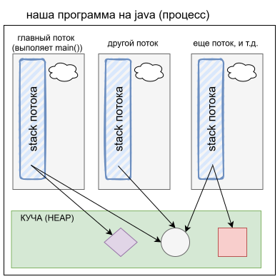

# Процесс и поток - что такое

## Ментальная модель процесса и потока

- Процессы и потоки в каждой ОС реализованы по-разному, нет смысла лишний раз думать об их реальном устройстве, лучше думать о них концептуально.
- Концептуально `процесс` - это выполняющаяся программа, которой выделен свой участок памяти (память процесса)
  - Процессы изолированы друг от друга на уровне ОС. Могут общаться только через специальные механизмы ОС (`IPC` - Inter-Process Communication). Межпроцессное взаимодействие к многопоточке не относится.
- `Поток` концептуально - это "рабочая единица", которая выполняет код. Когда создается процесс, тогда создается и поток, в котором выполняется функция main.
  - В main можно создать другие потоки - получится многопоточная программа.
- ОС переключает потоки - поток работает какое-то время, потом приостанавливается, начинает работать другой поток и так по кругу. ОС выделяет потоку квант времени и отправляет его работать. Когда квант исчерпан, управление возвращается к ОС, она выбирает следующий поток, дает ему квант и отправляет работать. И т.д.



## Куча и стек

- У процесса есть `куча` (heap) - это область памяти, в которой хранятся ссылочные типы данных. Например, сделали new ArrayList() - объект списка хранится в куче.
- У каждого потока есть персональный `стек` - это область памяти, в которой хранятся агрументы, передаваемые в функции, и локальные переменные функций. Очевидно, эта область памяти находится в границах памяти процесса.
  - Например, в main создали несколько переменных - они хранятся в стеке потока.
- Т.о. куча - одна на все потоки, а стек у каждого потока - свой.
  - В стеке хранятся примитивные типы данных, а на объектные хранятся ссылки, потому что как уже говорилось, объекты создаются в куче. Соответственно, когда у разных потоков есть ссылка на один и тот же объект в куче и они его как-то меняют, то возникают проблемы многопоточности.


# Примеры проблем многопоточности

## shared counter, неатомарность операций

- В чем проблема
  - Есть объект counter с int-полем value (значение)
  - Создается несколько потоков, у всех есть ссылка на этот counter, и они выполняют увеличение значения в цикле
  - Наивно ожидается что если 10 потоков сделают 1000 увеличений, конечное значение будет 10_000
    - Но это не так

```java
public class Counter {
    private int value = 0;

    public void increment() {
        value++;
    }

    public int get() {
        return value;
    }
}
```

```java
public class Main {
    public static void main(String[] args) throws InterruptedException {
        Counter counter = new Counter();

        Thread[] threads = new Thread[10];

        for (int i = 0; i < threads.length; i++) {
            threads[i] = new Thread(() -> {
                for (int j = 0; j < 1000; j++) {
                    counter.increment();
                }
            });
        }

        for (Thread thread : threads) {
            thread.start();
        }

        for (Thread thread : threads) {
            thread.join();
        }

        System.out.println(counter.get());
    }
}
```

- Почему не получается 10_000
  - Увеличение значения (value++, value += 1, value = value + 1 и т.д., не важно) - не атомарная операция. Т.е. она состоит из трех операций - "взять текущее значение", "вычислить новое", "записать вместо старого".
  - Поскольку квант времени может закончится в любой момент, то поток может не успеть записать результат. Соответственно, когда он вернется к работе, то запишет значение, которое вычислил в прошлый раз, и т.о. перезапишет результаты других потоков, которые работали после него. Поэтому часть "увеличений" счетчика и теряется.
  - Эта проблема называется `race condition`
  - TODO: стоит ли здесь сделать рисунок? Вроде бы для меня этот момент сейчас очевиден. Мб потом, когда делать нечего будет или выяснится, что забыл.


## ready-флаг, гарантии видимости изменений

- Суть проблемы
  - Наивно ожидаем увидеть 42, но возможны проблемы:
    - Видим 0
    - Ничего не видим, второй поток ничего не вывел
  - P.S. Хоть миллион раз запусти, эти проблемы могут не возникнуть, но это не доказывает, что их потенциально нет

```java
public class Main {

    public static void main(String[] args) throws InterruptedException {
        State state = new State();

        Thread writer = new Thread(() -> {
            state.number = 42;
            state.ready = true;
        });

        Thread reader = new Thread(() -> {
            if (state.ready) {
                System.out.println(state.number);
            }
        });

        writer.start();
        reader.start();

        writer.join();
        reader.join();
    }
}

class State {
    public int number = 0;
    public boolean ready = false;
}
```

- Почему проблемы
  - Потому что если не использовать специальные средства для работы с многопоточностью, то JVM не гарантирует видимость изменений, которые разные потоки делают над одними и теми же данными.
    - Это единственное приемлемое объяснение. Вся остальная чепуха насчет "реордеринга команд из-за оптимизаций", "кэширование" - вносит только путаницу, это попытки грубо объяснить очень низкоуровневые технические детали реализации, которые только извращают мышление, не давая реальной пользы.
  - Фактически это значит что если один поток записал number = 42 и ready = true, то другой поток может эти значения либо не увидеть вообще, либо увидеть частично. В общем, так и так получится ненадежная каша.
  - Чтобы таких проблем не было, нужна happens-before гарантия.


# happens-before гарантия

- `happens-before` ("происходит перед") связано с видимостью изменений данных, которые вносят потоки.
- Абстрактно сформулировать можно так: "Если действие А happens-before действия B, тогда действие B видит изменения, которые сделало действие А, причем ровно в том же порядке".
  - Дб понятнее на конкретном примере: запись в volatile-поле happens-before чтения из этого поля. На практике это значит, что если один поток пишет в volatile-поле, то другой поток гарантированно прочитает актуальное записанное значение. Без этой гарантии он может прочитать старое значение и никогда не увидеть новое.
- Многие многопоточные фишки дают happens-before гарантию.


# volatile - хочу актуальное значение

- `volatile`
  - Что дает
    - Гарантию видимости актуального значения
  - Чего не дает
    - атомарности операциям
  - К чему применяется
    - только к полям класса

```java
public class Worker implements Runnable {

    private volatile boolean running = true;  // <-- volatile

    @Override
    public void run() {
        System.out.println("Worker: начал работу");

        while (running) {
            System.out.println("Worker: работаю...");

            try {
                Thread.sleep(500);
            } catch (InterruptedException e) {
                Thread.currentThread().interrupt();
                break;
            }
        }

        System.out.println("Worker: остановлен");
    }

    public void stop() {
        running = false;
    }
}
```

```java
public class Main {
    public static void main(String[] args) throws InterruptedException {
        Worker worker = new Worker();

        Thread thread = new Thread(worker);
        thread.start();

        Thread.sleep(3000);

        System.out.println("Main: останавливаю Worker");

        worker.stop();

        thread.join();

        System.out.println("Main: программа завершена");
    }
}
```

- Объяснение
  - Создаем новый поток, в котором работает воркер
  - Потом из главного потока (в котором main выполняется), вызываем метод воркера, который пишет false в volatile-поле
  - Цикл while видит false и завершается. Когда run() метод доходит до конца, то в данном случае поток завершается.
  - Суть в том, что false пишется из главного потока, а читается из другого. Без volatile этот поток мог бы не увидеть изменение поля running и не остановился бы. volatile дает гарантию видимости актуального значения.


# syncronized - туалет занят, ждите

- `syncronized` - это ключевое слово, им можно помечать методы:

```java
public class BankAccount {
    private volatile int balance;

    public BankAccount(int balance) {
        this.balance = balance;
    }

    public synchronized void withdraw(int amount) {
        if (balance >= amount) {
            balance -= amount;
            System.out.println(Thread.currentThread().getName() + " снял " + amount);
        } else {
            System.out.println("Недостаточно средств");
        }
    }

    public synchronized void deposit(int amount) {
        balance += amount;
    }

    public int getBalance() {
        return balance;
    }

    public static void main(String[] args) throws InterruptedException {
        BankAccount account = new BankAccount(1000);

        Runnable task = () -> {
            account.withdraw(700);
        };

        Thread t1 = new Thread(task, "Thread-1");
        Thread t2 = new Thread(task, "Thread-2");

        t1.start();
        t2.start();

        t1.join();
        t2.join();

        System.out.println("Итоговый баланс: " + account.getBalance());
    }
}
```

- можно помечать блоки кода:

```java
public class PriceService {
    private final Object lock = new Object();
    private final Map<String, Integer> cache = new HashMap<>();

    public int getPrice(String productId) {
        // Быстрая проверка кэша — блокируем только доступ к Map
        synchronized (lock) {
            Integer cachedPrice = cache.get(productId);

            if (cachedPrice != null) {
                return cachedPrice;
            }
        }

        // Долгая операция выполняется БЕЗ блокировки
        int price = loadPriceFromDatabase(productId);

        // Снова короткий участок под блокировкой
        synchronized (lock) {
            cache.put(productId, price);
        }

        return price;
    }

    private int loadPriceFromDatabase(String productId) {
        // Представим, что здесь запрос к БД занимает 500 мс
        return 100;
    }
}
```

## Зачем нужно

- syncronized дает потоку монополию на участок кода - пока он полностью не выполнит syncronized-секцию, все остальные потоки, которые попробуют выполнить этот код, зависнут в ожидании.
- у каждого объекта есть `монитор`. syncronized захватывает этот монитор. если syncronized применяется к методу целиком, то это равнозначно syncronized (this), т.е. захватить монитор текущего объекта.
  - когда монитор освобождается, ОС берет один из зависших на нем потоков и ставит в работу.
- когда syncronized используется с блоком кода, то обычно делают отдельный объект для захвата, а не this. 
  - Это не позволяет внешнему коду случайно заблокировать секцию в PriceService. Например, какой-то внешний код взял и использовал объект PriceService для своей секции, которая вообще не имеет отношения к секциям внутри price service. Тогда если кто-то вызовет getPrice, то залипнет, потому что монитор price service'а занят.
- syncronized-блоки надо делать как можно меньше. Вся работа, которая не требует синхронизации, должна выполняться без нее, чтобы лишний раз не вешать потоки.


# Примитивы синхронизации

## mutex \ монитор

- `mutex` - (от mutual exclusion, взаимное исключение) - это примитив синхронизации, который подразумевает, что захватить его может только один поток. Если другой поток пытается захватить его, то уходит в блокировку и ждет, пока мьютекс освободится.
- `монитор` - чем-то отличается от мьютекса вроде, но я не понял чем. Но по сути одно и то же - только один поток может захватить монитор, остальные должны ждать, пока освободится, чтобы захватить.


# Пулы потоков


## TODO

- Планировщик (чего? потоков?) - что это?
- Вероятно, потоки можно не только создавать в программе, но и уничтожать? Или уничтожать явно нельзя, и этим занимается ОС?


# Склад


Но если сначала выучить **модель памяти + синхронизацию + happens-before + типичные схемы взаимодействия**, конкретные API потом становятся в основном переводом этих концепций на язык конкретной платформы.


- happens-before, volatile, syncronized


- Компилятор может переставлять операции
- CPU может выполнять операции не в их исходном порядке
- Значения могут находиться некоторое время в локальных кэшах \ буферах
- Примитивы синхронизации
  - mutex
  - 
- 


- Зачем sleep() и некоторые другие методы сбраывают флаг interrupt?


# Кирпичи

- atomicity, read-modify-write, race condition, check-then-act, put-if-absent, lazy initialization, compound actions
- "атомики", syncronized, lock (monitor lock), mutex, reentrant