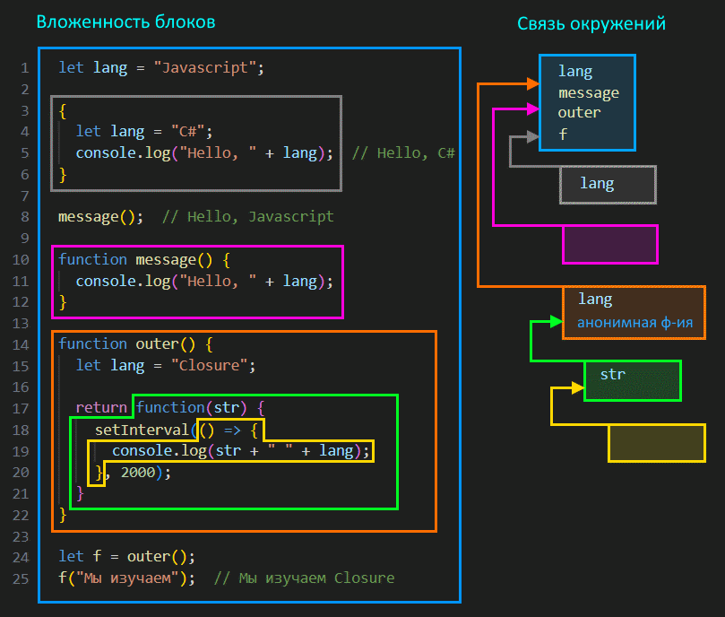

<h1>Оглавление</h1>
- TOC
{:toc}


# Внешние переменные

- просто подводка к окружениям и замыканиям
  - функции имеют доступ к внешним переменным, могут их изменять
  - если внутри функции есть переменная с таким же именем, как и внешняя, то функция будет пользоваться той, что "ближе" к ней, т.е. локальной
  - возможность работать с внешними переменными связана с понятием окружения

```javascript
let username = "Alice";

function hello() {
  let username = "Bob";  // <-- Функция воспользуется локальным username
  console.log("Привет, " + username);  // Привет, Bob
}

console.log(username);  // Alice
hello();  // Привет, Bob
```

```javascript
let username = "Alice";

function hello() {
  username = "Sam";  // Перезаписали внешнюю переменную.
  console.log("Привет, " + username);  // Привет, Sam
}

console.log(username);  // Alice
hello();  // Привет, Sam
console.log(username);  // Перезаписалось и стало Sam
```


# Окружение

- код логически представляет собой блоки, вложенные друг в друга
  - самый внешний блок - это скрипт в целом, top-level
  - функция внутри скрипта - это вложенный блок
  - функция внутри функции - еще один вложенный блок и т.д.
- у каждого блока есть так называемое **окружение** (environment)
  - в окружении хранятся все идентификаторы, присутствующие в этом блоке
    - например, для функции это параметры, локальные переменные, вложенные функции
    - для обычного блока, заключенного в `{ }`, это переменные и функции
    - для скрипта - тоже переменные и функции
- каждый блок имеет доступ не только к своему окружению, но и к внешнему - т.е. к окружению внешнего блока
  - т.о. формируется цепочка, по которой самый внутренний блок может добраться до окружения самого внешнего блока
  - поэтому, когда мы обращаемся к какому-то идентификатору, которого нет в собственном окружении блока (например, к переменной), он ищет его в окружении внешнего блока
    - если элемента нет и там, то ищет еще выше и т.д. до самого верха

Визуализация описанной механики:



- Комментарии к визуализации
  - желтый блок - лямбда с пустым окружением, т.к. у нее нет ни собственных параметров, ни локальных переменных
    - но в ней используются идентификаторы str и lang
    - поскольку в своем окружении она их не находит, она проверяет окружение внешнего блока - зеленого
      - там она обнаруживает идентификатор str (это параметр функции)
      - а lang там нет
        - поиск идет выше, в оранжевый блок
          - у него в окружении есть идентификатор lang (переменная)
    - т.о. желтый блок нашел и str, и lang, и может их использовать
- 🔥 Важно!
  - внешнее окружение функции определяется по моменту ее создания, а не моменту ее выполнения
    - например, обведенная зеленым функция:
      - *создается* внутри функции outer - когда в 24 строке мы вызываем outer, зеленая функция создается и сохраняется в переменную f
      - а *выполняется* "внутри скрипта", на top-level (25 строка)
    - соответственно для зеленой функции внешним окружением является окружение функции outer, а не окружение скрипта
      - поэтому lang равно Closure, а не Javascript
- Код с картинки

```javascript
let lang = "JavaScript";

{
  let lang = "C#";
  console.log("Hello, " + lang);  // Hello, C#
}

message();  // Hello, Javascript

function message() {
  console.log("Hello, " + lang);
}

function outer() {
  let lang = "Closure";

  return function(str) {
    setInterval(() => {
      console.log(str + " " + lang);
    }, 2000);
  };
}

let f = outer();
f("Мы изучаем");  // Мы изучаем Closure
```


# Замыкание

## Что такое замыкание

- **замыкание** (closure)
  - как термин CS - это функция, которая пользуется свободными переменными
  - **свободные переменные** для функции - это переменные, не являющиеся ее локальными переменными или параметрами
    - одним словом, "внешние" по отношению к ней
  - не во всех языках можно обращаться к внешним переменным, но в JS - можно
    - пример срача на тему что такое замыкание и является ли функция, приведенная автором, замыканием, можно  [почитать тут](https://qna.habr.com/q/1113012)
    - итог обсуждения
      - вопрос "приведите пример замыкания" - дискуссионный и требует уточнить у спрашивающего, что лично он понимает под замыканием

Вот например про такую функцию можно сказать, что она не является замыканием, потому что не пользуется свободными переменными:

```javascript
let name = "Tom";

function message() {
  console.log("Hello");
}
```

А вот про такую - можно сказать, что она является замыканием, потому что пользуется свободной переменной - name:

```javascript
let name = "Tom";

function message() {
  console.log("Hello, " + name);  // <-- Используем свободную переменную name
}
```

Однако может попасться человек, который и вторую функцию не назовет замыканием. Для таких замыканием является только что-то вроде такого:

```javascript
function counter() {
  let count = 0;
  return function() {
    count++;  // <-- Функция пользуется свободной переменной и описана внутри другой функции
  }
}

let cnt = counter();
cnt();  // Переменная count станет 1
cnt();  // Переменная count станет 2
```

Так что в случае споров нужно уточнять у спрашивающего, что именно он понимает под замыканием.

## Замыкание и окружение

- 🔥в замыкании важен факт, что оно удерживает внешнее окружение в памяти
  - за счет этого можно реализовать инкапсуляцию и состояние

Возьмем такой код:

```javascript
function foobar() {
  let lang = "JavaScript";  
  console.log("Мы изучаем " + lang);
}

foobar();  // Мы изучаем Javascript
```

Здесь нет замыкания. После выполнения функции foobar, ее окружение удалится из памяти.

А теперь вот такой код:

```javascript
function foobar() {
  let lang = "JavaScript";

  return function R(str) {  // <-- функция R будет удерживать окружение foobar в памяти
    console.log(str + " " + lang);  // потому что пользуется переменной из ее окружения
  }
}

let f = foobar();
f("Мы изучаем");  // Мы изучаем JavaScript
```

- здесь есть замыкание, потому что функция R использует переменную lang из окружения foobar
  - стало быть, когда мы будем вызывать R, ей для получения значения lang потребуется окружение foobar
    - а значит окружение foobar нельзя удалять из памяти
      - поэтому оно останется там до тех пор, пока существует ссылка на R
- в данном примере, если бы мы в конец добавили например `f = null;`, то потеряли бы ссылку на R, а стало быть и ссылку на окружение foobar
  - вот в этом случае сборщик мусора удалил бы его


# Дополнительно

Просто позадротствовать

## Функция просто вложена в функцию

Когда функция просто описана внутри другой функции, их окружения тоже связаны:

```javascript
function outer() {
  function inner() {
    console.log(message);
  }

  let message = "Эта переменная описана в функции outer."
  inner();
}

outer();  // "Это переменная описана в функции outer."
```

Здесь функция `inner()` видит переменную `message`, описанную в функции `outer()`, потому что окружение inner имеет ссылку на окружение outer. Опять же, видим что визуально одна функция вложена в другую, значит их окружения связаны.

## Функции вложены в объекты

Если из функции возвращается не функция, а объект с функциями (методами), то это не влияет на принципы организации связи окружений этих функций. Связь окружений по-прежнему можно определить визуально:

```javascript
const person = {
  firstname: "Huck",
  lastname: "Finn",
  foobar() {
    let fn = this.firstname;
    let ln = this.lastname;
    // let fn = firstname;  // Так была бы ошибка [1]
    // let ln = lastname;
    return {
      next() {
        return {
          fn2: fn, // [2]
          ln2: ln,
          nomatter() {
            let obj = {
              value1: fn + " " + ln,
              value2: this.fn2 + " " + this.ln2
              // value2: fn2 + " " + ln2  // Так была бы ошибка [3]
            }
            return obj;
          }
        }
      }
    }
  }
};

const foo = person.foobar();
const obj = foo.next().nomatter();
console.log(obj.value1);  // Huck Finn
console.log(obj.value2);  // Huck Finn
```

Здесь у нас объект person с двумя полями firstname и lastname и методом foobar(). В этом методе создается две переменные и в них кладутся значения из полей. Поскольку метод foobar вызывается на объекте person, то this указывает на person и все работает. Если же написать без this, как в показано в `[1]`, то будет ошибка. Т.к. в функции foobar нет переменных firstname и lastname, она будет искать их в окружении скрипта. Там их тоже нет, поэтому и ошибка.

Далее из метода foobar возвращается объект с методом next(). Именно что не функция next() возвращается, а объект с методом next(), это важно. А этот метод тоже возвращает объект, в котором два поля fn2 и ln2 и метод nomatter(). Тут специально намешано таких вложений объектов и методов, чтобы показать, что все эти вложения никак не влияют на связь окружений. Так вот, в моменте `[2]` мы обращаемся к идентификаторам fn и ln. Это обращение происходит, по сути, внутри функции next(). Т.е. неважно, что эта строчка написана внутри объекта, это не меняет факта, что обращение происходит внутри функции next(). В собственном окружении next таких идентификаторов нет, поэтому она ищет их во внешнем окружении, т.е. в окружении функции foobar. Там они есть, поэтому значения берутся из них и успешно попадают в поля объекта.

Далее идет метод nomatter. В нем создается объект obj с двумя полями. В одном идет обращение к fn и ln, а в другом - к this.fn2 и this.ln2. Касаемо fn и ln, таких идентификаторов в собственном окружении у функции nomatter нет, поэтому она ищет их во внешнем окружении - в окружении функции next. Там их тоже нет, поэтому ищет дальше - в окружении foobar. Там они есть, поэтому все работает. Ну а к fn2 и ln2 обращени идет через this, соответственно this указывает на объект, на котором nomatter вызывается как метод.

Вся эта писанина просто для того, чтобы продемонстрировать, что когда речь идет об окружениях, то "визуальный" метод работает одинаково, где бы функции ни находились - хоть непосредственно возвращаются из функций, хоть находятся в составе объектов, хоть как.