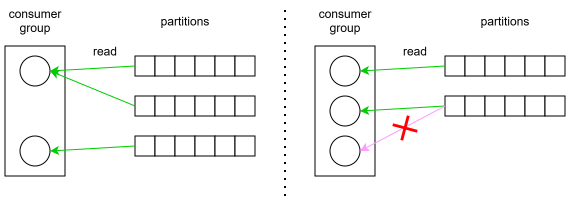

# Kafka - распределенная система

## Брокеры

- `Брокер` - это один работающий экземпляр кафки
  - Представляет собой один процесс в ОС, который порождает много потоков
- Кафка - это распределенная система, т.е. можно взять несколько серверов, запустить на каждом один брокер и объединить их в кластер
  - Т.о. получить отказоустойчивость и горизонтальную масштабируемость
  - В проде имеет смысл выделять под каждый брокер отдельный сервер. Нет смысла на одном сервере запускать несколько брокеров, например на разных виртуальных машинах. Потому что, во-первых, они будут конкурировать за ресурсы, значит никакой масштабируемости. А во-вторых, если сервер ляжет, то лягут и оба брокера. Значит, никакой отказоустойчивости
    - Имеет смысл только в учебных целях локально, чтобы тренироваться настраивать кластер

## Контроллер кластера

- `Контроллер кластера` - это брокер, который берет на себя менеджерские обязанности
  - Например, выбор нового лидера партиции при падении текущего лидера
- Контроллер может быть как чисто контроллером, так и контроллером+работягой
  - Т.е. выполнять либо чисто менеджерские функции, либо совмещать их еще и с хранением данных
  - В современной архитектуре рекомендуется разделять функции брокеров на контроллеры и работяги, чтобы управление и хранение не перемешивалось

## Прозводительность

- При создании топика кафка старается размазать его партиции равномерно по всем брокерам кластера
  - Например, в топике 4 партиции и есть 4 брокера - идеальный случай, будет по одной партиции на брокере
  - Если будет 4 партиции и 3 брокера, значит на каком-то брокере будет 2 партиции
  - Поэтому рекомендуется делать количество партиций кратным количеству брокеров, чтобы размазывание происходило равномерно: 3 брокера - 3 \ 6 \ 9 партиций, 4 брокера - 4 \ 8 \ 16 партиций и т.д.
    - Это не жесткое требование, но хорошая практика

## Метаданные

- Метаданные - это полная информация о кластере - сколько в нем брокеров, их адреса, сколько топиков, партиций, где они лежат, кто для них лидер и т.д.
- Метаданные хранятся на всех брокерах и автоматически обновляются по мере появления изменений
- Клиент может подключиться к любому из брокеров, получить метаданные и по ним понять, к какому именно брокеру ему надо обращаться для непосредственной работы с топиком
- Клиент перезапрашивает метаданные сам
  - По таймеру (автоматически каждые 5 минут)
  - При появлении ошибок при работе с брокером

# Организация данных

## Топик и партиции

- `Топик` - делит хранимые данные по смыслу
  - Например
    - Трекинг система действий пользователя
      - В одном топике - клики, скроллы, переходы по страницам и т.д.
      - В другом топике - когда зашел, когда вышел
      - В третьем - кого добавил в друзья, кого удалил
    - Система оформления заказов
      - По топику на заказы, платежи, уведовления
  - Благодаря этому системы могут потреблять только нужные им данные, а не все подряд
- `Партиции` - это физическое хранение топика
  - Один топик можно делить на несколько партиций
    - Это нужно для масштабируемости - сколько партиций, столько и консюмеров смогут параллельно читать топик
    - Разумное практическое количество партиций на топик это 6-30. Технически можно сделать даже несколько тысяч партиций на один топик, но это сильно снизит производительность

## Сообщения

- Данные в кафке хранятся в виде `сообщений`, т.е. сообщение - это единица хранения информации
  - Еще называют запись \ record
- Состав сообщения
  - Ключ - используется для определения, в какую партицию положить сообщение
  - Значение - полезная нагрузка сообщения
  - Заголовки - дополнительная метаинформация
  - Таймштамп - время создания сообщения

## Продюсеры и консюмеры

- `Продюсеры` - пишут сообщения в брокер (кафку)
- `Консюмеры` - читают сообщения из брокера

## Способ хранения данных

- Кафка хранит данные в файлах на диске
- В оперативке хранится кэш
  - Т.е. сперва идет чтение из оперативки и если там нужных данных нет, тогда читается с диска и помещается в кэш
- Партиция - это папка, а внутри нее лежат файлы - `сегменты`
  - Это сделано чтобы старые данные можно было удобно удалять и при записи не приходилось работать с гигантским единым файлом
- Одна партиция хранится целиком на одном брокере
  - Т.е. данные одной партиции не размазаны по нескольким брокерам, а хранятся в одном месте
  - Но разные партиции могут храниться на разных брокерах, даже если принадлежат одному топику
    - Т.о. образом растет скорость работы с топиком за счет параллельной работы с партициями

# Запись данных

## Как определяется партиция

- Ключ сообщения проходит через хэш-функцию и на основе этого определяется партиция, в которую попадет сообщение
  - Так что сообщения с одним ключом гарантированно окажутся в одной партиции
  - Партиция работает по приципу FIFO, новые данные записываются в конец очереди, а чтение идет с начала
  - В качестве ключа надо выбрать такое значение, которое сгруппирует связанные данные, когда это нужно и важен порядок. Очередь уже гарантирует нам соблюдение порядка, нам остается выбрать ключ, чтобы все связанные сообщения попадали в одну партицию
    - Например, берем ключ vehicle_id. Автомобиль передает координаты своего движения, они попадают в брокер, в одну и ту же партицию. Порядок соблюден - так что какой-нибудь сервис может читать эти координаты и делать вычисления, рисовать маршрут на карте и т.д.
- Если ключ не задан, то данные пишутся в партиции по round-robin
  - Это дает равномерное распределение данных по партициям
  - Полезно в ситуациях, когда для консюмера не критичен порядок получения сообщений и он может его восстановить сам
    - Например, метрики с датчика. Если у них есть временная метка, можно просто сохранять их себе в БД и строить графики на основе этой метки, а не порядке в очереди. Порядок в очереди важен например в транзакциях, командах микросервисов.

## Семантика доставки

- Семантика доставки - это гарантии доставки сообщений, которые кафка дает продюсеру
- Три логических вида
  - `at-most-once` - "максимум один".
    - Быстро и ненадежно. Просто отправил и все. Если сообщение не дошло, значит не повезло, оно не попадет в очередь.
  - `at-least-once` - "минимум один"
    - Надежно, но возможны дубли. Брокер отправляет продюсеру подтверждение сохранения. Если подтверждение потерялось по дороге, продюсер пошлет еще одно сообщение, которое брокер воспримет как новое. Получится дубль.
  - `exactly-once` - "точно один"
    - Самое медленное, но самое точное. Гарантия доставки и гарантия, что не будет дублей.
- Технически можно достигнуть этих семантик разными комбинациями опций отправки, но логически возможны все равно только три этих варианта

## Особенности записи

## Батчи

- Продюсер отправляет сообщения не по одному, а пачками (`batch`)
  - Это дает меньше сетевых вызовов
- "Отправить пачку" фактически означает лишь поместить ее в очередь отправки, а когда она реально уйдет по сети - не продюсерская забора
- Есть два параметра пачек
  - Размер пачки (по умолчанию 16кб)
  - `linger.ms` (по умолчанию 0) - время, через которое надо точно отправить пачку, независимо от степени ее заполненности
- Как это связано?
  - Допустим ставим linger.ms 10
    - Тогда продюсер будет накидывать сообщения в пачку либо пока она не заполнится полностью, либо пока не истечет это время
    - Заполнилась или вышло время - пачка отправляется как есть в очередь на отправку. При низкой нагрузке это означает, что пачка из одного сообщения не будет ждать вечно своего наполнения
  - Если linger.ms 0, то это означает не ждать наполнения пачки совсем, а отправлять ее сразу как поступило сообщение. Поэтому в теории это будут пачки из одного сообщения. Но на практике при высоких нагрузках даже при 0 в пачках может оказываться несколько сообщений

## Компрессия сообщений

- По умолчанию сообщения не сжимаются
- За компрессию отвечает параметр `compression.type` у продюсера
  - Там есть несколько вариантов gzip, snappy, lz4, zstd, отличаются скоростью работы и степенью сжатия
- При включенной компрессии продюсер сжимает пачку, она уходит в брокер в сжатом виде и в сжатом же виде попадает консюмеру и он сам ее распаковывает

# Чтение данных

## Консюмер

- Чтением данных из топика занимаются консюмеры
- Чтение происходит пачками, например консюмер читает сразу 100 сообщений и кладет себе в память
- Прочитанные сообщения не удаляются из кафки из-за самого факта чтения, они хранятся столько времени, сколько потребуется
- Один консюмер можно воспринимать как одного логического потребителя данных, например, приложение
- Несколько приложений - несколько разных консюмеров
- Один консюмер может читать несколько топиков
- Консюмер может подписаться на чтение топика, тогда партиция для него назначится автоматически
  - Но также есть возможность явно указать, из какой партиции читать. При этом если консюмер ляжет, другие консюмеры не смогут подхватить партицию за него

## Группа консюмеров

- Для ускорения чтения приложение может использовать несколько консюмеров, при этом как бы логически они считаются одним консюмером
- Это называется `consumer group` - группа консюмеров
- Технически, даже если консюмер только один, он все равно оформлен как группа
- Особенности организации группы консюмеров
  - Один консюмер из группы может читать одну или несколько партиций
  - Разные консюмеры из группы не могут читать одну и ту же партицию
  - Например, в топике 4 партиции
    - И только один консюмер - тогда он будет читать по кругу из всех 4 партиций
    - Если два консюмера - работа в два раза быстрее, первый например читает 1 и 2 партицию, а второй 3 и 4
      - Если один из консюмеров ляжет, то второй возьмет на себя его работу
    - Если 6 консюмеров - то 4 консюмера будут читать, каждый по одной партиции, а еще 2 консюмера будут простаивать

## Офсет

- `Offset` - это само по себе просто номер сообщения в партиции
- Но в контексте консюмеров имеется ввиду `сохраненный офсет`, т.е. позиция, до которой дочитал конкретный консюмер
- Офсет позволяет консюмеру не терять положение чтения
- Офсет характеризуется тремя вещами: id группы консюмеров, партицией и номером сообщения

## Коммит офсета

- Офсет хранится в памяти консюмера и пока консюмер работает, он знает позицию чтения
- Но если консюмер упадет и следовательно офсет потеряется, то после восстановления консюмер не будет знать, откуда читать
- Поэтому периодически офсет надо коммитить
  - Это позволит консюмеру или его товарищу из группы продолжить чтение с правильной позиции
- Коммит можно настроить либо `автоматический`, либо делать `вручную`
  - Это несовместимые способы - мы либо делаем вручную, либо автоматически, но не и то и другое вместе
  - Автоматический коммит срабатывает по таймеру
  - Автокоммит обычно используется для сценариев, где потеря чтений некритична (логи, метрики)
  - Для бизнес-сценариев обычно используется ручной коммит из-за большей предсказуемости и контроля

## Порядок сообщений при чтении

- Порядок сообщений соблюдается только в пределах партиции
- Если консюмер читает несколько партиций, то сообщения из них идут вперемешку
- Аналогично если консюмер читает из нескольких топиков, то их сообщения тоже идут вперемешку

# Очистка данных

- Политика очистки данных (`cleanup.policy`)
  - Удаление (`delete`)
    - По двум триггерам
      - Партиция превысила указанный размер - если суммарный размер сегментов партиции превысил заданный размер, то кафка удаляет старые сегменты
        - Они будут удаляться, пока размер партиции снова не станет меньше, чем задано
      - Сегмент стал очень старый (по умолчанию 7 дней) - если сегмент хранится дольше указанного времени, он удаляется
  - Сжатие (`compact`)
    - Из неактивных сегментов удаляются все значения для каждого ключа, кроме последнего
      - Например, есть `id123: active`, `id123: processing`, `id123: disabled` а после компакта останется только `id123: disabled`
    - Для нахождения сегментов, которые готовы к сжатию, используется отдельный фоновый процесс
- Для каждой политики есть свои настройки, которые можно загуглить когда потребуется выполнять настройку

# Отказоустойчивость

## Репликация

- Отказоустойчивость достигается за счет `репликации` данных
  - Т.е. партиция хранится уже не на одном брокере, а на нескольких
    - На скольки - определяет `Фактор репликации`
      - Если фактор 2, значит партиция будет лежать на двух брокерах, если 3 - значит на трех и т.д.
      - Фактор репликации не может быть больше количества брокеров
        - Например, если брокеров 4, то фактор может быть 2 или 3, но не 5, потому что пятую копию просто физически некуда положить
  - Один из брокеров становится лидером партиции (`leader`), а остальные брокеры - фоловерами (`follower`)
    - Тут важно понять, что лидер - это термин, характеризующий именно комбинацию брокер+партиция. Т.е. один конкретный брокер является лидером для этой конкретной партиции, и одновременно фоловером для другой партиции. Нет такого что в кластере один брокер - как бы общий лидер. Лидерство всегда связано с партицией.
    - Запись \ чтение всегда ведется в лидера
    - Фоловеры синхронизируются с лидером и вступают в игру только когда лидер падает
      - Тогда кафка выбирает нового лидера из фоловеров
      - Синхронизация данных происходит асинхронно, поэтому несмотря на все предосторожности есть небольшой шанс, что лидер упадет до синхронизации и тогда несинхронизированные данные потеряются 

## acks и ISR

- `ISR` - In-Sync Replicas - это список фоловеров, которые синхронизированы с лидером партиции
  - Есть параметр `replica.lag.time.max.ms` (по умолчанию 30 сек) он определяет "срок свежести" для реплик. Если у фоловера последняя сихнронизация была больше 30 сек назад, он считается неактуальным
  - Лидер партиции ведет список ISR самостоятельно, регулярно проверяя фоловеров и исключая их из списка
    - Проверка ведется отдельным фоновым процессом, который работает по таймеру. По умолчанию это половина от установленного "срока свежести"
    - Сам лидер всегда входит в этот список
    - Возврат в список "свежих" происходит при синхронизации
    - Список также передается в контроллер кластера, на случай если лидер упадет
- `acks` - producer acknowledgements
  - Это параметр, указывает сколько фоловеров из списка ISR должны подтвердить получение сообщения, чтобы продюсер посчитал отправку успешной
  - Значения
    - `acks=0` - не требуется подтверждений вообще ни от кого. Быстро и ненадежно.
    - `acks=1` - требуется подтверждение только от лидера. Средняя скорость и средняя надежность.
    - `acks=all` - требуется подтверждение от всех фоловеров, которые в данный момент в списке ISR. Низкая скорость, максимальная надежность.

# Ребалансировка

- Ребалансировка бывает двух видов
  - Ребалансировка партиций между брокерами (`partition reassignment`)
    - Происходит, когда в кластер добавляется новый брокер, т.к. нужно провести перераспределение партиций между брокерами
    - Кафка автоматически этого не делает, надо запускать самостоятельно или настраивать автозапуск, иначе добавленный брокер будет просто простаивать
    - Особенности
      - Чтение из партиций не останавливается
  - Ребалансировка консюмеров (`consumer rebalance`)
    - Происходит, когда 
      - В группе консюмеров добавляется \ удаляется консюмер (добавили нового или упал один из работающих)
      - Когда консюмер подписывается на дополнительный топик
    - Кафка выполняет эту ребалансировку автоматически
    - Особенности
      - Чтение на время этой ребалансировки останавливается - никто из группы ничего не читает

# Работа с ошибками

## Dead Letter Queue

- `DLQ` - это паттерн, при котором сообщение, которое не удалось обработать, мы отправляем в специальный топик
  - Для обработки таких топиков делаем отдельных консюмеров

# TODO

- Больше про формат сообщений, про ключ, нагрузку, таймштамп, когда ключ задается. А то я смотрю на JSON, его поля и думаю, это блять что такое? Это нагрузка или прямо "часть сообщения кафки"?
- Как ключ влияет на партицию? Как-то сам указываешь что куда класть или кафка сама делает?