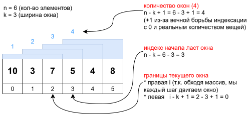

# Sliding Window Maximum

## Условие

> - Дан массив целых чисел `nums` и целое число `k` (размер окна).
> - Окно двигается от начала массива к концу на один элемент за раз.
> - Нужно вернуть массив, содержащий **максимальный элемент в каждом окне**.
>
> Пример:
>
> ```java
> nums = [1,3,-1,-3,5,3,6,7], k = 3
>     
> Windows:
> [1,3,-1] → 3
> [3,-1,-3] → 3
> [-1,-3,5] → 5
> [-3,5,3] → 5
> [5,3,6] → 6
> [3,6,7] → 7
> 
> Output: [3,3,5,5,6,7]
> ```


## Подход к решению

- Используется скользящее окно + монотонная очередь
  - Монотонная очередь - это очередь, в которой элементы располагаются по возрастанию \ убыванию
- В очереди хранятся индексы элементов, "кандидатов на максимум"
- Важно понять:
  - Игру с индексами и размером окна
    - Как из этого вычислить количество окон
    - Как понять индекс, с которого начинается очередное окно
  - Принципы поддержания очереди в актуальном состоянии:
    - В очереди только индексы элементов из текущего окна
    - Индексы стоят так, что соответствующие им элементы образуют монотонную очередь
    - В очереди нет элементов, которые не имеют шансов стать максимумом


## Решение

```java
import java.util.*;

class Solution {
    public static int[] maxSlidingWindow(int[] arr, int k) {
        int n = arr.length;
        var result = new int[n - k + 1];
        var deq = new ArrayDeque<Integer>();

        for (int i = 0; i < arr.length; i++) {
            while (!deq.isEmpty() && deq.peekFirst() < i - k + 1) {
                deq.pollFirst();
            }
            while (!deq.isEmpty() && arr[i] > arr[deq.peekLast()]) {
                deq.pollLast();
            }

            deq.offerLast(i);

            if (i - k + 1 >= 0) {  // альтернатива: i >= k - 1
                result[i - k + 1] = arr[deq.peekFirst()];
            }
        }

        return result;
    }
}
```

- Объяснение
  - Нужно поддерживать очередь в актуальном состоянии:
    - В очереди не должно быть индексов элементов, которые уже вышли из окна
      - Для этого вычисляем левую границу текущего окна, и выщелкиваем из головы очереди индексы, которые слева от этой границы.
    - В голове очереди всегда должен быть индекс того элемента, который сейчас максимальный в окне. А за ним должны стоять "кандидаты". Кандидат - это самый близкий к нему по величине. Например, в [10, 3, 5] максимум это 10, а кандидат это 5.
      - Для этого берем текущий элемент окна и выщелкиваем из хвоста очереди элементы (элементы, не индексы!), которые меньше текущего.
    - Т.о. всегда в голове очереди будет стоять максимум текущего окна.
  - Когда очередь приведена в актуальное состояние, можно добавлять очередной элемент окна.
  - И мы этот максимум тут же записываем в результат. По сути, очередной элемент мог оказаться кандидатом, а не максимумом, и мы просто перезапишем шило на мыло в результат. Но это неважно.
    - Надо только вычислить индекс массива результата, куда писать этот максимум. Плюс пока первое окно не сформировано до конца, надо быть осторожным с этим вычислением.
      - `i >= k - 1` - логика "Допустим, ширина окна 3. Тогда у первого окна правая граница на индексе 2 (3 - 1). Соответственно, когда индекс дойдет до 2, можно использовать его для расчета левой границы окна". А левая граница нам позволяет понять, в какой индекс результата писать максимум.
      - `i - k + 1 >= 0` - математически вроде то же самое, но логически это мне понятнее. Просто вычисляем левую границу текущего окна, которая по определению не может начинаться раньше чем с нуля. И если граница ок, тогда записываем в результат, т.к. индекс левой границы показывает нам индекс результата.
- Картинка для визуализации мышления об окне




