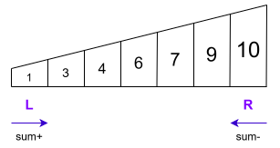
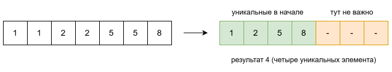

# Метод "Два указателя"

- two pointers - не алгоритм, а метод, подход.
- Самое характерное применение - для линейных структур (массив, список, строка).
- Базируется на том, что есть два указателя, которые двигаются по какому-то принципу
  - Например
    - Движение навстречу
      - left \ right - левый на первом элементе, правый -  на последнем.
    - Движение в одном направлении
      - slow \ fast - оба указателя стартуют с одной стороны структуры, идут в одну сторону с "разной скоростью".
- Разные задачи могут требовать разные условия, например то что структура должна быть отсортирована. Но это уже не относится напрямую к указателям, это именно требование, которое позволяет делать определенные предположения.


# left \ right указатели

## Развернуть массив

Решение с максимально наглядным использованием two pointers:

```java
public static int[] reverse(int[] arr) {
    int left = 0;
    int right = arr.length-1;

    while (left < right) {
        int temp = arr[left];
        arr[left] = arr[right];
        arr[right] = temp;

        left++;
        right--;
    }

    return arr;
}
```


## Палиндром

- Палиндром - это слово, которое одинаково читается слева направо и справа налево.
- Вариации задачи
  - Проверять слово
  - Проверять строку
  - Дополнительные условия, вроде "игнорировать все, кроме букв и цифр", "учитывать пробелы" и т.д.

---

- Решение для "игнорируйте регистр, учитывайте пробелы":

```java
// TODO: Реализуйте проверку палиндрома (игнорируя регистр и НЕ игнорируя пробелы)
public static boolean isPalindrome(String s) {
    int left = 0;
    int right = s.length() - 1;

    while (left < right) {
        if (Character.toLowerCase(s.charAt(left)) != 
            Character.toLowerCase(s.charAt(right))
           ) {
            return false;
        }
        left++;
        right--;
    }

    return true;
}
```

- Комментарии
  - Почему не преобразовать всю строку к lower case сначала?
    - Можно, но тогда решение увеличит память с $O(1)$ до $O(n)$, потому что создается новая строка.

---

- Решение для "игнорируйте регистр и все, кроме букв и цифр"
  - Например `A man, a plan, a canal: Panama` должно дать true

```java
// TODO: Реализуйте проверку палиндрома (игнорируя: регистр и все кроме букв \ цифр)
    public static boolean case2(String s) {
        int left = 0;
        int right = s.length() - 1;

        while (left < right) {
            while (left < right && !Character.isLetterOrDigit(s.charAt(left))) {
                left++;
            }

            while (left < right && !Character.isLetterOrDigit(s.charAt(right))) {
                right--;
            }

            if (Character.toLowerCase(s.charAt(left)) !=
                Character.toLowerCase(s.charAt(right))
            ) {
                return false;
            }
            left++;
            right--;
        }

        return true;
    }
```

- Комментарии:
  - Предварительное очищение строки от "лишних" символов дает увеличение потребления памяти, ну и возня с регулярками. Поэтому не используем.
    - Просто двигаем указатели до тех пор, пока не встретим букву \ цифру и т.о. реализуем игнор лишнего.


## Сумма двух чисел ("Two Sum")

### Суть задачи

- P.S. "Two sum" это не "две суммы", это "сумма двух (чисел)"
- Дан массив чисел. Найти два числа, сумма которых равна target.
  - В классическом условии надо вернуть первые два подходящих числа.
  - Но в целом можно и все подходящие пары найти, просто продолжая двигать указатели.
  - Могут требовать вернуть индексы элементов, или сами элементы.
- Массив отсортирован, это важно. Если не отсортирован, то методом двух указателей задачу не решить.
- Например

```java
int[] nums = { 1, 2, 4, 6, 8, 9, 14 };
// найти два числа, сумма которых 10
// первая подходящая пара - это 1 и 9
// дальше 2 и 8, 4 и 6
```

- Цель задачи - понять принцип движения указателей, в каком случае нужно двигать left, а в каком right и почему.

### Решение

- Вернем сами элементы, первые подходящие:

```java
public static int[] twoPointers(int[] arr, int target) {
    int left = 0;
    int right = arr.length - 1;

    while (left < right) {
        int sum = arr[left] + arr[right];
        if (sum < target) {
            left++;
        } else if (sum > target) {
            right--;
        } else {
            return new int[] { arr[left], arr[right] };
        }
    }

    throw new IllegalArgumentException("No pair found");
}
```

- Комментарии
  - Принцип движения указателей
    - Изначально левый указатель стоит на первом элементе, правый - на последнем.
    - Т.к. массив отсортирован, то левый указатель стоит на самом маленьком элементе, а правый - на самом большом. Соответственно, в каждый момент все числа справа от L больше, а все числа слева от R меньше.
    - Указатели двигаются навстречу друг другу.
    - Если суммы "мало", ее надо увеличивать, если суммы "много", то ее надо уменьшать.
      - Увеличение суммы идет движением L, потому что массив отсортирован и справа от L гарантированно стоят числа, которые больше. Значит движение L дает большее число и сумма увеличивается.
      - Уменьшение суммы идет движением R, потому что там числа меньше. Прибавление меньшего числа уменьшает сумму.




# slow \ fast указатели


## Удалить дубликаты из отсортированного массива

> * Дан отсортированный массив целых чисел `nums`. Удалите дубликаты из массива так, чтобы каждый уникальный элемент встречался только один раз. При этом порядок элементов должен сохраниться.
>
> * Верните количество уникальных элементов `k`.
>
> * Первые `k` элементов массива `nums` должны содержать уникальные элементы в том же порядке, в котором они были изначально.
>
> * Элементы после первых `k` позиций не имеют значения.
>
>   
>
> * Своими словами
>
>   * Переместить все уникальные элементы в начало массива и вернуть индекс-границу "сортированного куска"



```java
public static int slowFast(int[] arr) {
    if (arr.length == 0) return 0;

    int slow = 0;

    for (int fast = 0; fast < arr.length; fast++) {
        if (arr[slow] != arr[fast]) {
            slow++;
            arr[slow] = arr[fast];
        }
    }

    return slow + 1;
}
```

- Комментарии
  - Два указателя движутся от первого элемента в одну сторону.
  - fast - "ищущий", slow - "рабочий" позиционируется на элемент, в который будем перекладывать найденный уникальный.
  - За счет сортировки одинаковые элементы стоят рядом - это ключевое.
    - Потому что как только встретили отличающийся элемент, точно можем сказать, что предыдущий уже не появится дальше.
  - Перезапись "самого на себя" это нормально, не надо микрооптимизаций.


# TODO

Хорошие задачи для освоения Two Pointers:

1. **Two Sum II — Input Array Is Sorted**
2. **Valid Palindrome**
3. **Remove Duplicates from Sorted Array**
4. **Container With Most Water** ← как раз эта
5. **3Sum** — уже следующий уровень


Чтобы почувствовать метод руками:

1. ~~**Развернуть массив** — увидеть два указателя.~~
2. ~~**Проверить палиндром** — увидеть движение навстречу~~.
3. ~~**Two Sum в отсортированном массиве** — понять, почему можно двигать `left/right`.~~
4. ~~**Удалить дубликаты из отсортированного массива** — познакомиться с `slow/fast`.~~
5. **Объединить два отсортированных массива** — два указателя на разных массивах.
6. Потом уже переходить к более интересным задачам с **движущимся окном (sliding window)** — это близкий родственник two pointers.

Если хочешь именно **научиться решать**, а не просто понять теорию, лучший следующий шаг — взять 3–5 очень простых задач и **решить их вместе пошагово, сначала без кода, двигая указатели вручную**. Это обычно очень быстро закрепляет идею.