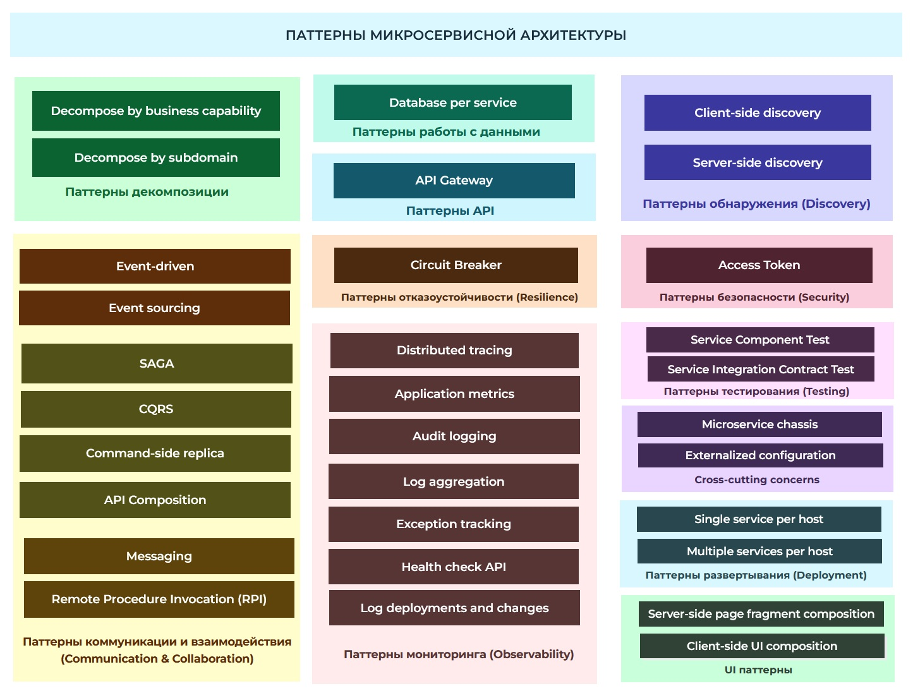
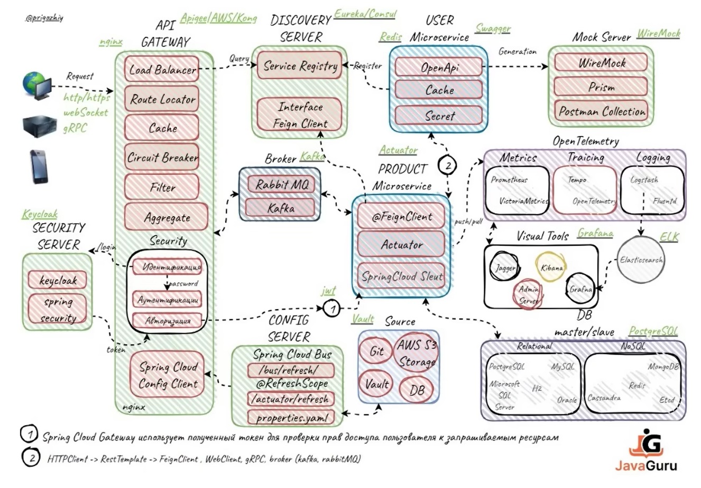
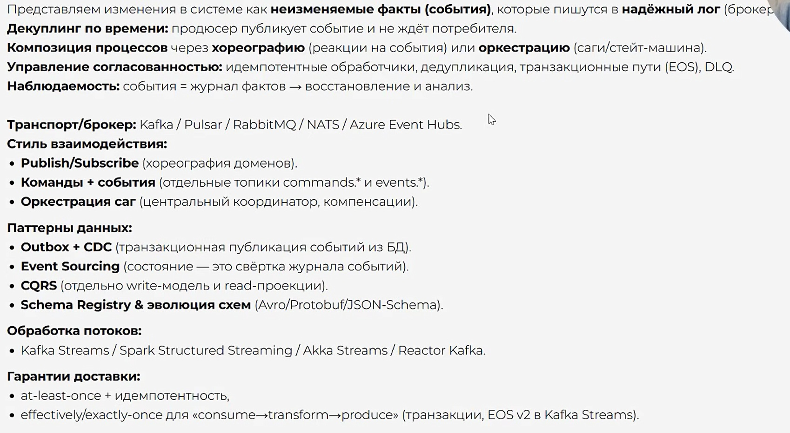

# Обзор паттернов

# Взаимосвязь паттернов + технологии

# Технологии, про которые загуглить

- feign client

# Микросервисная архитектура

- По каким принципам система дробится на микры?
- Транзакции ACID, BASE, SAGA
  - Нет консистентности "в моменте", как в ACID, нужны компенсирующие транзакции

# Database per service

- БД одна именно на весь сервис? Или все-таки на инстанс?

# API Gateway

- Единая точка входа в приложение
  - Конечные пользователи приложения не знают о структуре приложение, какие там микросервисы, сколько инстансов, какие адреса и т.д.
    - Все они обращаются к API Gateway
- гейт проксирует запросы к нужным микрам (роутинг)
  - плюс выполняет другие функции, вроде балансировки, аутентификации, кэширования и т.д.
    - более полный список - на картинке
  - обеспечение отказоустойчивости - Curcuit Breaker, мб реализован на стороне микров, а может - на стороней гейта
  - агрегация
    - можно ждать ответы от нескольких микров, собирать данные в единый блок и отправлять клиенту
- Варианты реализации
  - Обычное Spring boot приложение + Spring Cloud
  - Ingres + Kuber ???

## Вопросы

- Бывает несколько инстансов гейта?
- Как аутентификация работает?
  - если ее делает гейт, то сами микры как проверяют валидность запроса? и проверяют ли вообще?

# Обнаружение сервисов

- Базовая проблема
  - Как клиент сервиса узнает его адрес, с учетом того что сервис может перезапускаться (меняется адрес), могут добавляться новые реплики \ удаляться старые реплики?
- Базовое решение
  - Сделать реестр сервисов ("discovery-сервис")
    - Каждый сервис при старте будет регистрироваться в реестре, а клиент будет через реестр получать информацию об инстансах сервиса
- Доп. инфа
  - Клиент не при каждом запросе опрашивает реестр, а периодически
    - поподробнее почитать про стратегии
  - Для балансировки можно использовать Spring Cloud Load Balancer
    - Consul
    - Eureka
    - etcd
    - Zookeeper

## Client-side discovery

- Клиент сам взаимодействует с discovery-сервисом

## Server-side discovery

- Клиент взаимодействует с маршрутизатором, который обращается к дискавери

# Circuit Breaker

- Паттерн отказоустойчивости
- Проблема - падение одного микросервиса приводит к падению остальных
  - А > B > C > D
    - D сломался, от этого ломается C, т.к. не может получить ответ от D, дальше ломается B, потом A
  - т.о. вся система каскадно ложится и вообще все перестает работать
- Решение - при невозможности получить ответ от реального сервиса переключаемся на fallback method
  - Периодически опрашиваем упавший сервис и как только он поднялся, снова переключаемся с fallback на реальный сервис
- Можно делать через
  - feign
  - hystrix
  - sentiel
  - spring retry
  - guava CircuitBreaker
  - Aegis
- Дополнительные паттерны
  - rate limiting
  - bulkheading
  - automatic retrying (sync и async)
  - result caching
  - timeout handling

## Вопросы

- Этот паттерн завсегдатай в схеме? Или допустим если есть event driven, то брейкер не нужен?

# Access Token

- Технологии
  - keycloak
  - OAuth
- Запрос приходит на гейт, затем через сервис авторизации к нему пришивается токен с правами и дальше все запросы снабжаются этим токеном, так что сервисы, на которые запрос приходит, понимают права, доступные этому запросу

# Event Driven

https://javaguru.by/eventdriven

- Outbox паттерн - чтобы была консистентность при записи микром в БД + в кафку, т.к. нельзя допустить, чтобы в БД записалось, а в кафку - нет
  - CDC Debezium

## Вопросы

- Event Driven отбрасывает необходимость сервисов знать друг о друге?

# Event Sourcing

https://javaguru.by/eventsourcing

- Дополнение к Event Driven
- Основная идея
  - Мы не храним "текущее состояние" системы, как в стандартных CRUD-приложениях
    - Потому что не понятно, как оно получилось
      - В случае проблем, следовательно, трудно делать откаты
  - Вместо этого мы храним цепочку событий, произошедших в системе
  - За счет этого можем "проиграть события" и получить "текущее состояние"
  - Для ускорения можно также периодически делать "снапшоты" с "текущим состоянием", чтобы каждый раз не рассчитывать его с самого начала
- Как делается
  - Моделируется система состояний \ событий OrderCreated, OrderApproved, OrderShipped, OrderRejected и т.д.
  - Произошедшие с сущностью события сохраняются под единым id в Event Store
    - Хранилище событий можно реализовать разными технологиями, можно на РСУБД в том числе
    - Но лучше на технологиях типа "журнал"

## Вопросы

- Kafka можно использовать как СУБД? Она вообще не только в памяти живет? Какие еще ограничения?
- Что делать, если со временем появляются новые события для сущности? А допустим старые либо меняются, либо перестают быть нужными?

# SAGA

https://javaguru.by/saga

- Проблема - когда бизнес-процесс затрагивает несколько микров и каждый делает локальную транзакцию в своей БД, то если в каком-то микре происходит ошибка, надо откатить транзакции в БД других микров
- Решения вроде 2PC, 3PC (2-phase-commit, двух- и трех-фазные коммиты) добавляют сложностей, но способны дать strong consistency (мгновенную согласованность, ACID вроде еще она называется?)
- Если допустима eventual consistency (т.е. не мгновенная согласованность, а "согласованность по итогу", BASE она вроде называется?), тогда используют паттерн Saga
  - Согласованность по итогу - это когда в моменте данные микров могут быть не согласованы (т.е. в одном микре транзакция уже применена, и еще не знает, что надо откатиться), но в итоге приходят к согласованию, когда все события обработаются
- Способы реализации
  - Хореография
    - Как работает
      - Микр делает транзакцию и публикует событие
      - Другой микр получает событие и запускает свою транзакцию
      - Если происходит ошибка, тоже публикуется событие об этом
      - Первый микр видит событие ошибки и запускает у себя компенсирующую транзакцию
      - В итоге, "по итогу", когда все события обработаются, данные снова консистентные
    - Суть
      - Микры сами реагируют на события вроде "Товар зарезервирован", "Прошла \ не прошла оплата"
        - Т.о. формируется как бы неявная связь между сервисами из-за событий
      - Нет "единой точки реакции" на события, поэтому такой способ подходит для небольших систем, где мало микров и их взаимодействие очевидно и наглядно
  - Оркестрация
    - Все события проходят через сагу. Например, сервис резервирования резервирует товар, выпускает событие "Товар зарезервирован". На это событие реагирует не сервис оплаты, а сага. Она выпускает команду "Оплатить", вот на нее уже реагирует сервис оплаты. Допустим, оплата провалилась, сервис выпускает событие "Оплата провалилась". На нее реагирует не сервис резервирования, а сага. Она выпускает соответствующую команду, и тогда уже на нее реагирует сервис резервирования, отменяя резерв. Таким образом сервисы как бы не привязаны друг к другу, они реагируют не на события, а на команды, приходящие из единого источника - саги.
    - Т.о. получается весь процесс регулируется оркестратором, который после каждого шага понимает, что делать дальше - либо продолжать процесс, либо запускать компенсации.
- ВАЖНО
  - Запись в локальную БД и публикация события в брокер - должны выполняться транзакционно!
    - Т.е. грубо говоря, если в базу записалось, а в брокер событие не ушло - это косяк, значит из БД надо стирать
      - Outbox паттерн
        - Camunda тоже где-то тут (вроде бы)

# CQRS

- CQRS - Command \ Query Responsibility Segregation

## Материал

- На хранение - реляционная СУБД, на чтение - elastic search
  - когда приходит команда ("запись"), через брокер формируется событие на синхронизацию read-базы с write-базой

## Вопросы

- CQRS может быть даже с одной базой? Т.е. грубо говоря, этот паттерн дает концептуально возможность использовать разные базы, но можно и на одной?
- Database per service как сюда вяжется?
- 

# Общие вопросы

- Изменение микросервиса
  - Когда один сервис изменили, то как его деплоить? ведь кто-то им пользовался, значит и его надо менять?

# Общие термины

- Латентность
  - Время между "запрос отправил - запрос получил"